# Distributed Transaction Patterns - Enhanced E-commerce Sequence Diagrams

## Scenario: Customer Order Processing
A customer places an order that requires:
1. Payment processing ($99.99)
2. Inventory reduction (1 item)
3. Shipping arrangement
4. Order confirmation

---

## 2PC (Two-Phase Commit)

### Success Path
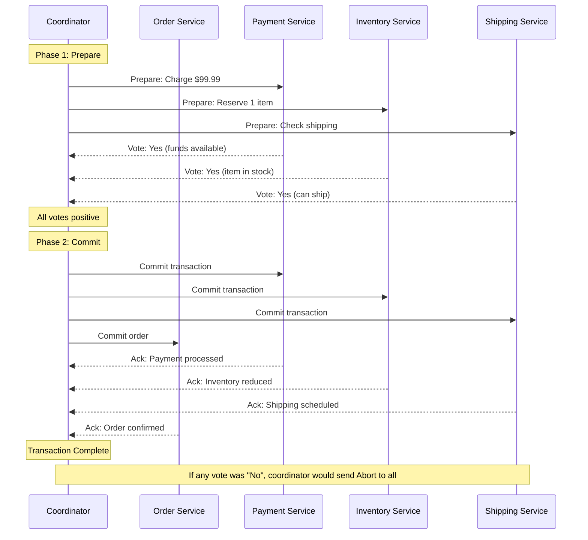
```mermaid
sequenceDiagram
    participant C as Coordinator
    participant O as Order Service
    participant P as Payment Service
    participant I as Inventory Service
    participant S as Shipping Service

    Note over C: Phase 1: Prepare
    C->>P: Prepare: Charge $99.99
    C->>I: Prepare: Reserve 1 item
    C->>S: Prepare: Check shipping
    
    P-->>C: Vote: Yes (funds available)
    I-->>C: Vote: Yes (item in stock)
    S-->>C: Vote: Yes (can ship)
    
    Note over C: All votes positive
    Note over C: Phase 2: Commit
    
    C->>P: Commit transaction
    C->>I: Commit transaction
    C->>S: Commit transaction
    C->>O: Commit order
    
    P-->>C: Ack: Payment processed
    I-->>C: Ack: Inventory reduced
    S-->>C: Ack: Shipping scheduled
    O-->>C: Ack: Order confirmed

    Note over C: Transaction Complete
    
    Note over C,S: If any vote was "No", coordinator would send Abort to all
```

### Coordinator Failure Scenario
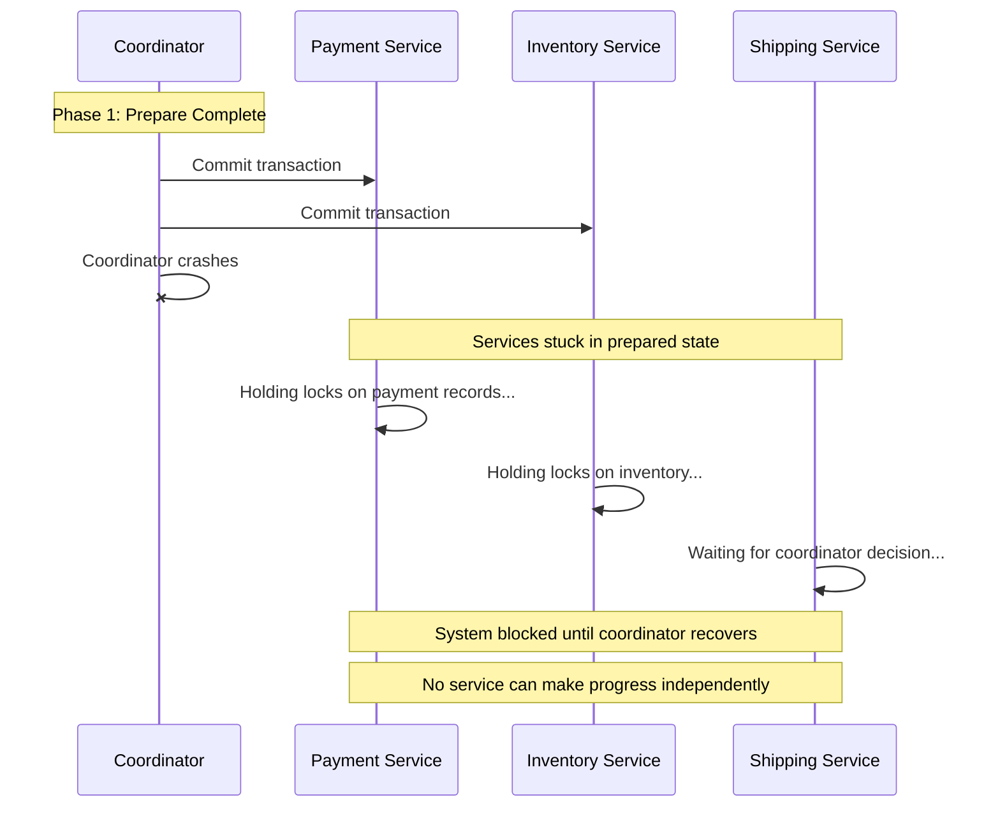
```mermaid
sequenceDiagram
    participant C as Coordinator
    participant P as Payment Service
    participant I as Inventory Service
    participant S as Shipping Service

    Note over C: Phase 1: Prepare Complete
    C->>P: Commit transaction
    C->>I: Commit transaction
    C-xC: Coordinator crashes
    
    Note over P,S: Services stuck in prepared state
    P->>P: Holding locks on payment records...
    I->>I: Holding locks on inventory...
    S->>S: Waiting for coordinator decision...
    
    Note over P,S: System blocked until coordinator recovers
    Note over P,S: No service can make progress independently
```

**Characteristics:**
- Synchronous, blocking
- All participants must be available
- Strong consistency
- Coordinator is single point of failure
- System-wide blocking on coordinator failure

---

## Saga Pattern

### Success Path
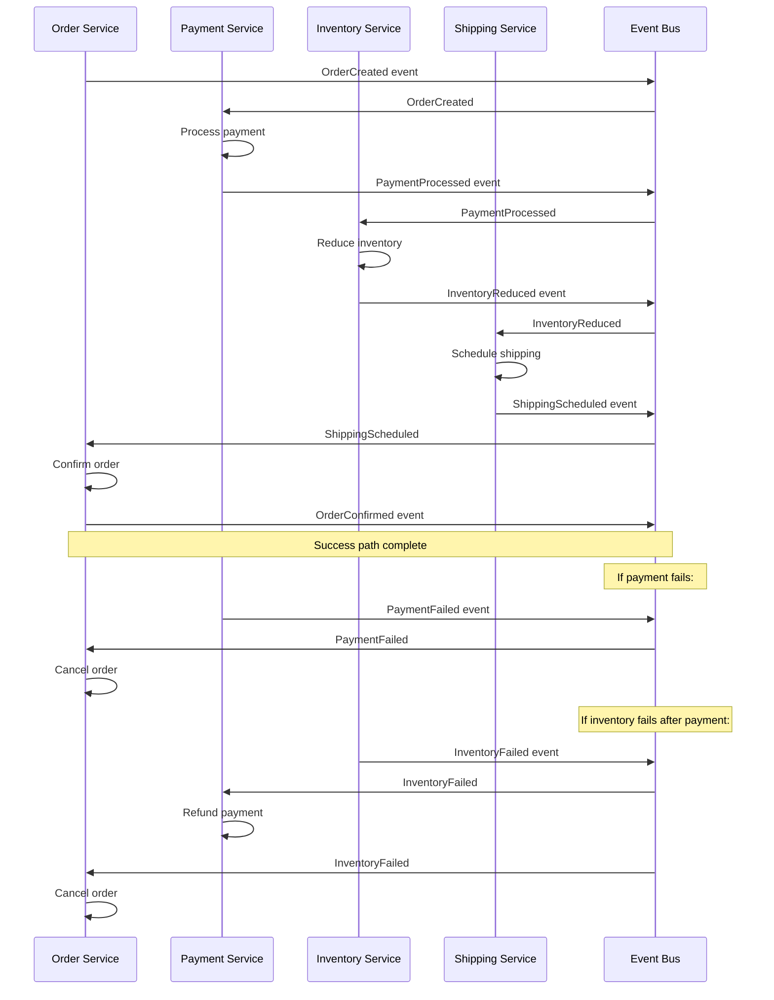
```mermaid
sequenceDiagram
    participant O as Order Service
    participant P as Payment Service
    participant I as Inventory Service
    participant S as Shipping Service
    participant E as Event Bus

    O->>E: OrderCreated event
    
    E->>P: OrderCreated
    P->>P: Process payment
    P->>E: PaymentProcessed event
    
    E->>I: PaymentProcessed
    I->>I: Reduce inventory
    I->>E: InventoryReduced event
    
    E->>S: InventoryReduced
    S->>S: Schedule shipping
    S->>E: ShippingScheduled event
    
    E->>O: ShippingScheduled
    O->>O: Confirm order
    O->>E: OrderConfirmed event

    Note over O,E: Success path complete

    Note over E: If payment fails:
    P->>E: PaymentFailed event
    E->>O: PaymentFailed
    O->>O: Cancel order
    
    Note over E: If inventory fails after payment:
    I->>E: InventoryFailed event
    E->>P: InventoryFailed
    P->>P: Refund payment
    E->>O: InventoryFailed
    O->>O: Cancel order
```

### Race Condition Scenario
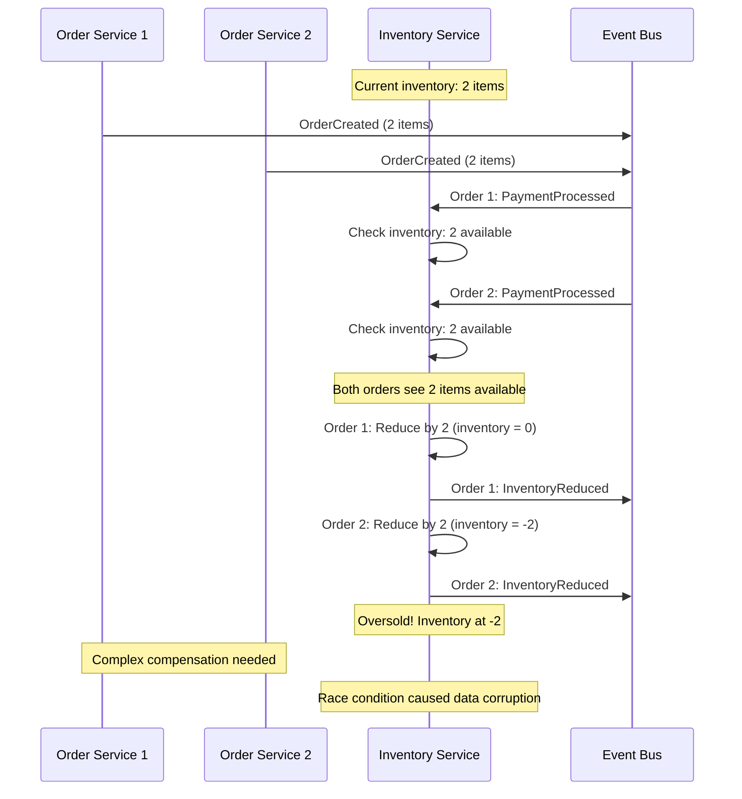
```mermaid
sequenceDiagram
    participant O1 as Order Service 1
    participant O2 as Order Service 2
    participant I as Inventory Service
    participant E as Event Bus

    Note over I: Current inventory: 2 items
    
    O1->>E: OrderCreated (2 items)
    O2->>E: OrderCreated (2 items)
    
    E->>I: Order 1: PaymentProcessed
    I->>I: Check inventory: 2 available
    E->>I: Order 2: PaymentProcessed
    I->>I: Check inventory: 2 available
    
    Note over I: Both orders see 2 items available
    
    I->>I: Order 1: Reduce by 2 (inventory = 0)
    I->>E: Order 1: InventoryReduced
    
    I->>I: Order 2: Reduce by 2 (inventory = -2)
    I->>E: Order 2: InventoryReduced
    
    Note over I: Oversold! Inventory at -2
    Note over O1,O2: Complex compensation needed
    Note over I: Race condition caused data corruption
```

**Characteristics:**
- Asynchronous, event-driven
- Services are loosely coupled
- Eventual consistency
- Complex compensation logic
- No isolation between concurrent sagas
- Vulnerable to race conditions

---

## 0.5PS (Zero-Point-Five Phase Saga)

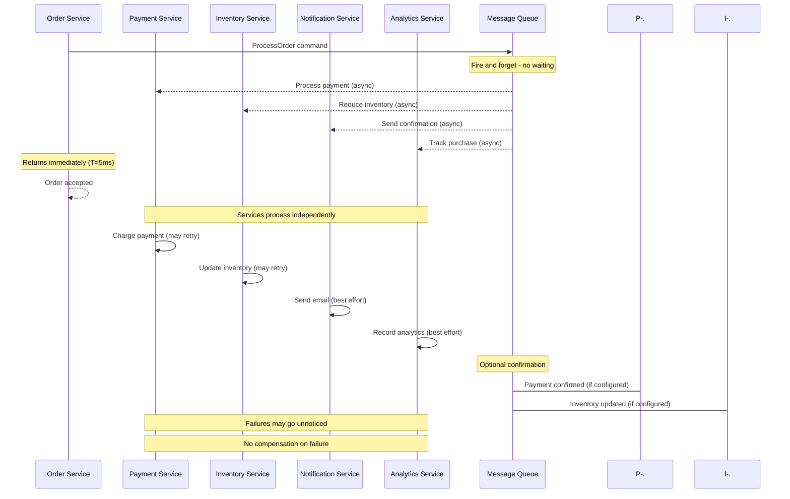
```mermaid
sequenceDiagram
    participant O as Order Service
    participant P as Payment Service
    participant I as Inventory Service
    participant N as Notification Service
    participant A as Analytics Service
    participant Q as Message Queue

    O->>Q: ProcessOrder command
    
    Note over Q: Fire and forget - no waiting
    Q-->>P: Process payment (async)
    Q-->>I: Reduce inventory (async)
    Q-->>N: Send confirmation (async)
    Q-->>A: Track purchase (async)
    
    Note over O: Returns immediately (T=5ms)
    O-->>O: Order accepted

    Note over P,A: Services process independently
    P->>P: Charge payment (may retry)
    I->>I: Update inventory (may retry)
    N->>N: Send email (best effort)
    A->>A: Record analytics (best effort)

    Note over Q: Optional confirmation
    P-.->Q: Payment confirmed (if configured)
    I-.->Q: Inventory updated (if configured)
    
    Note over P,A: Failures may go unnoticed
    Note over P,A: No compensation on failure
```

**Characteristics:**
- True fire-and-forget
- No blocking, returns immediately
- Best effort delivery
- Suitable for non-critical operations
- Silent failures possible
- Fastest response time

---

## 1.5PS (One-Point-Five Phase Saga)

### Standard Flow with Decision Points
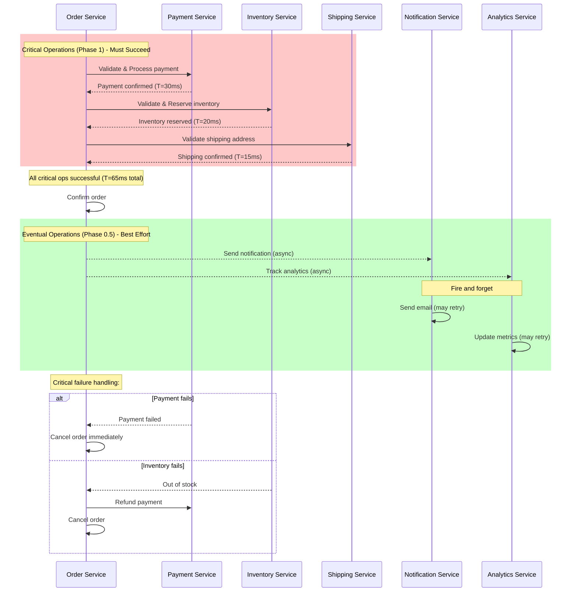
```mermaid
sequenceDiagram
    participant O as Order Service
    participant P as Payment Service
    participant I as Inventory Service
    participant S as Shipping Service
    participant N as Notification Service
    participant A as Analytics Service

    rect rgb(255, 200, 200)
        Note over O: Critical Operations (Phase 1) - Must Succeed
        O->>P: Validate & Process payment
        P-->>O: Payment confirmed (T=30ms)
        
        O->>I: Validate & Reserve inventory
        I-->>O: Inventory reserved (T=20ms)
        
        O->>S: Validate shipping address
        S-->>O: Shipping confirmed (T=15ms)
    end

    Note over O: All critical ops successful (T=65ms total)
    O->>O: Confirm order

    rect rgb(200, 255, 200)
        Note over O: Eventual Operations (Phase 0.5) - Best Effort
        O-->>N: Send notification (async)
        O-->>A: Track analytics (async)
        
        Note over N,A: Fire and forget
        N->>N: Send email (may retry)
        A->>A: Update metrics (may retry)
    end

    Note over O: Critical failure handling:
    alt Payment fails
        P-->>O: Payment failed
        O->>O: Cancel order immediately
    else Inventory fails
        I-->>O: Out of stock
        O->>P: Refund payment
        O->>O: Cancel order
    end
```

**Characteristics:**
- Critical operations are synchronous
- Non-critical operations are fire-and-forget
- Mixed consistency model
- Practical for real systems
- Clear separation of concerns
- Fast failure for critical operations

---

## 2PS (Two-Phase Saga)

### Standard Flow with Timing
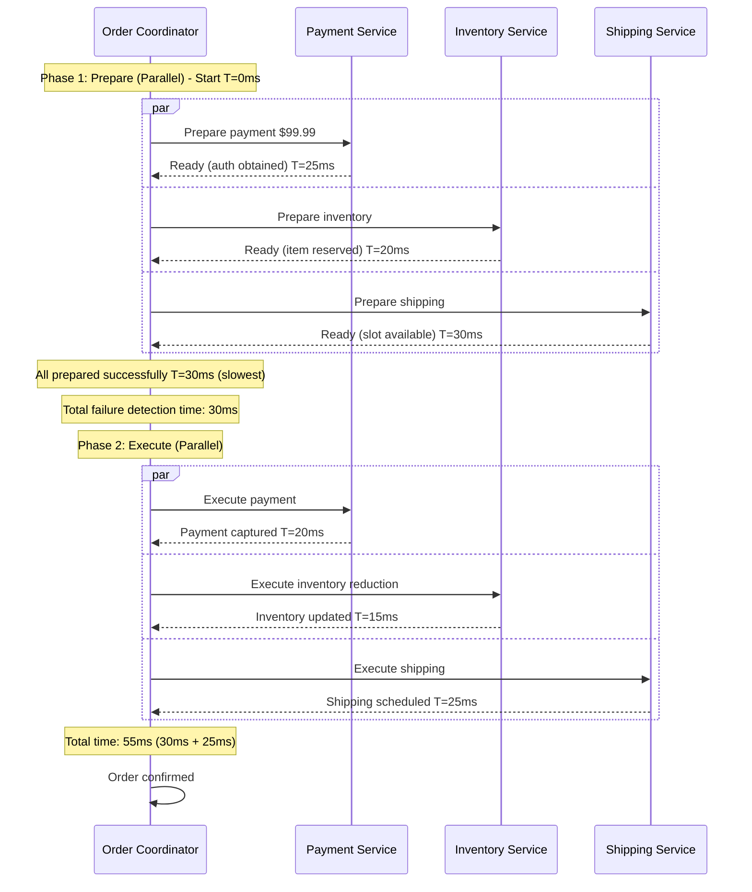
```mermaid
sequenceDiagram
    participant O as Order Coordinator
    participant P as Payment Service
    participant I as Inventory Service
    participant S as Shipping Service

    Note over O: Phase 1: Prepare (Parallel) - Start T=0ms
    par
        O->>P: Prepare payment $99.99
        P-->>O: Ready (auth obtained) T=25ms
    and
        O->>I: Prepare inventory
        I-->>O: Ready (item reserved) T=20ms
    and
        O->>S: Prepare shipping
        S-->>O: Ready (slot available) T=30ms
    end

    Note over O: All prepared successfully T=30ms (slowest)
    Note over O: Total failure detection time: 30ms
    
    Note over O: Phase 2: Execute (Parallel)
    par
        O->>P: Execute payment
        P-->>O: Payment captured T=20ms
    and
        O->>I: Execute inventory reduction
        I-->>O: Inventory updated T=15ms
    and
        O->>S: Execute shipping
        S-->>O: Shipping scheduled T=25ms
    end

    Note over O: Total time: 55ms (30ms + 25ms)
    O->>O: Order confirmed
```

### Failure Detection Comparison
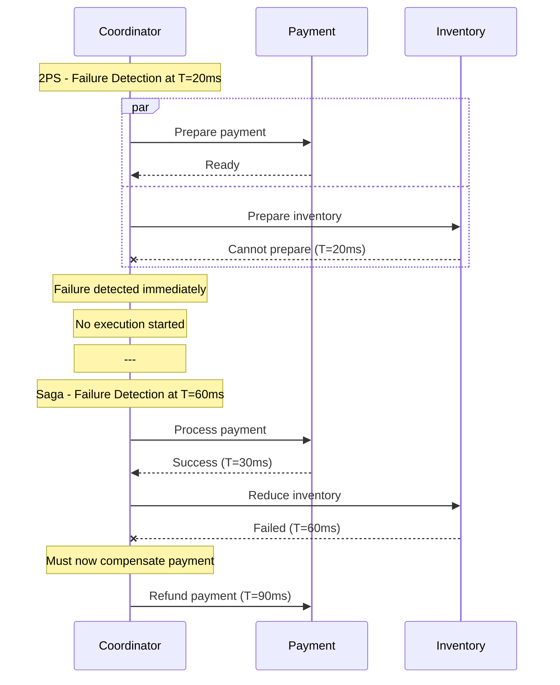
```mermaid
sequenceDiagram
    participant O as Coordinator
    participant P as Payment
    participant I as Inventory
    
    Note over O: 2PS - Failure Detection at T=20ms
    par
        O->>P: Prepare payment
        P-->>O: Ready
    and
        O->>I: Prepare inventory
        I--xO: Cannot prepare (T=20ms)
    end
    Note over O: Failure detected immediately
    Note over O: No execution started
    
    Note over O: ---
    
    Note over O: Saga - Failure Detection at T=60ms
    O->>P: Process payment
    P-->>O: Success (T=30ms)
    O->>I: Reduce inventory
    I--xO: Failed (T=60ms)
    Note over O: Must now compensate payment
    O->>P: Refund payment (T=90ms)
```

**Characteristics:**
- Two distinct phases
- Parallel execution within phases
- Early failure detection in prepare
- Simpler than 3PS
- Fastest failure detection (single gate)

---

## 3PS (Three-Phase Saga)

### Standard Flow with Independent Progress
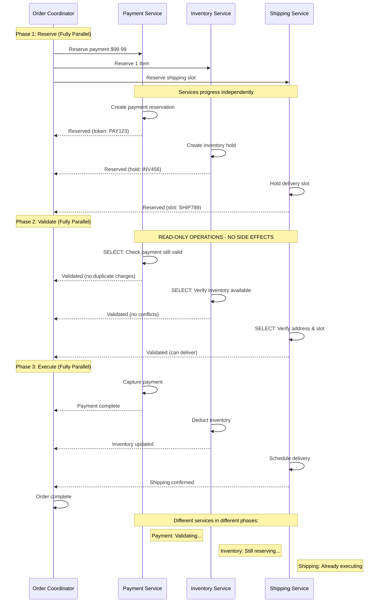
```mermaid
sequenceDiagram
    participant O as Order Coordinator
    participant P as Payment Service
    participant I as Inventory Service
    participant S as Shipping Service

    Note over O: Phase 1: Reserve (Fully Parallel)
    
    O->>P: Reserve payment $99.99
    O->>I: Reserve 1 item
    O->>S: Reserve shipping slot

    Note over P,S: Services progress independently
    
    P->>P: Create payment reservation
    P-->>O: Reserved (token: PAY123)
    
    I->>I: Create inventory hold
    I-->>O: Reserved (hold: INV456)
    
    S->>S: Hold delivery slot
    S-->>O: Reserved (slot: SHIP789)

    Note over O: Phase 2: Validate (Fully Parallel)
    Note over P,S: READ-ONLY OPERATIONS - NO SIDE EFFECTS
    
    P->>P: SELECT: Check payment still valid
    P-->>O: Validated (no duplicate charges)
    
    I->>I: SELECT: Verify inventory available
    I-->>O: Validated (no conflicts)
    
    S->>S: SELECT: Verify address & slot
    S-->>O: Validated (can deliver)

    Note over O: Phase 3: Execute (Fully Parallel)
    
    P->>P: Capture payment
    P-->>O: Payment complete
    
    I->>I: Deduct inventory
    I-->>O: Inventory updated
    
    S->>S: Schedule delivery
    S-->>O: Shipping confirmed

    O->>O: Order complete

    Note over P,S: Different services in different phases:
    Note right of P: Payment: Validating...
    Note right of I: Inventory: Still reserving...
    Note right of S: Shipping: Already executing
```

### Resource State Tracking
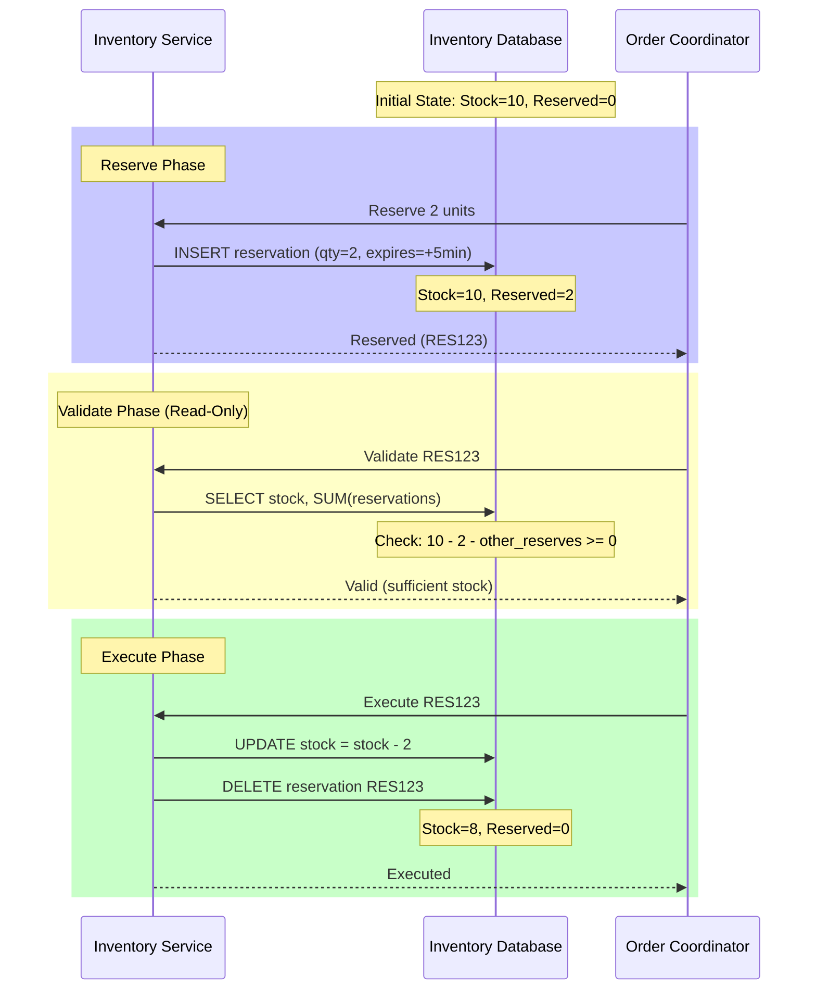
```mermaid
sequenceDiagram
    participant I as Inventory Service
    participant DB as Inventory Database
    participant O as Order Coordinator

    Note over DB: Initial State: Stock=10, Reserved=0
    
    rect rgb(200, 200, 255)
        Note over I: Reserve Phase
        O->>I: Reserve 2 units
        I->>DB: INSERT reservation (qty=2, expires=+5min)
        Note over DB: Stock=10, Reserved=2
        I-->>O: Reserved (RES123)
    end
    
    rect rgb(255, 255, 200)
        Note over I: Validate Phase (Read-Only)
        O->>I: Validate RES123
        I->>DB: SELECT stock, SUM(reservations)
        Note over DB: Check: 10 - 2 - other_reserves >= 0
        I-->>O: Valid (sufficient stock)
    end
    
    rect rgb(200, 255, 200)
        Note over I: Execute Phase
        O->>I: Execute RES123
        I->>DB: UPDATE stock = stock - 2
        I->>DB: DELETE reservation RES123
        Note over DB: Stock=8, Reserved=0
        I-->>O: Executed
    end
```

### Validation Catches Race Condition
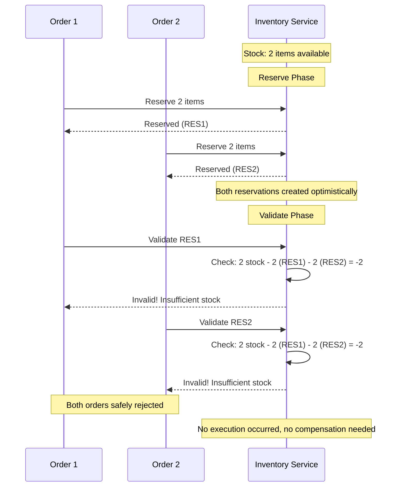
```mermaid
sequenceDiagram
    participant O1 as Order 1
    participant O2 as Order 2
    participant I as Inventory Service

    Note over I: Stock: 2 items available
    
    Note over I: Reserve Phase
    O1->>I: Reserve 2 items
    I-->>O1: Reserved (RES1)
    O2->>I: Reserve 2 items
    I-->>O2: Reserved (RES2)
    
    Note over I: Both reservations created optimistically
    
    Note over I: Validate Phase
    O1->>I: Validate RES1
    I->>I: Check: 2 stock - 2 (RES1) - 2 (RES2) = -2
    I-->>O1: Invalid! Insufficient stock
    
    O2->>I: Validate RES2
    I->>I: Check: 2 stock - 2 (RES1) - 2 (RES2) = -2
    I-->>O2: Invalid! Insufficient stock
    
    Note over O1,O2: Both orders safely rejected
    Note over I: No execution occurred, no compensation needed
```

**Characteristics:**
- Three distinct phases for safety
- Fully parallel - services progress independently
- Validation catches race conditions
- Most complex coordination
- "Distributed ACID" without locks
- Read-only validation phase critical for safety

---

## Pattern Comparison

### Timing and Performance

```mermaid
gantt
    title Operation Latency Comparison
    dateFormat X
    axisFormat %Lms
    
    section 2PC
    Prepare Phase     :2pc1, 0, 50
    Wait for votes    :milestone, 50, 0
    Commit Phase      :2pc2, after 2pc1, 50
    
    section Saga
    Payment          :saga1, 0, 30
    Inventory        :saga2, after saga1, 30
    Shipping         :saga3, after saga2, 30
    
    section 2PS
    Prepare (parallel) :2ps1, 0, 30
    Wait barrier      :milestone, 30, 0
    Execute (parallel) :2ps2, after 2ps1, 25
    
    section 3PS
    Reserve          :3ps1, 0, 20
    Validate         :3ps2, 15, 20
    Execute          :3ps3, 30, 20
    
    section 1.5PS
    Critical ops     :15ps1, 0, 65
    Eventual ops     :15ps2, 0, 5
```

### Characteristics Matrix

| Pattern | Phases | Parallelism | Consistency | Failure Detection | Complexity | Use Case |
|---------|--------|-------------|-------------|-------------------|------------|----------|
| 2PC | 2 | Within phase | Strong | Fast (blocking) | Medium | Financial transactions |
| Saga | 1 | Sequential/Parallel | Eventual | During execution | High (compensations) | Long-running workflows |
| 0.5PS | 0.5 | Fully parallel | None | Poor/Never | Lowest | Analytics, notifications |
| 1.5PS | 1.5 | Mixed | Mixed | Fast for critical | Low | Real-world systems |
| 2PS | 2 | Within phase | Moderate | Fastest (30ms) | Medium | General purpose |
| 3PS | 3 | Fully parallel | Strong-ish | Good | Highest | Complex microservices |

## Reality Check: Common Pitfalls

### Network Timeouts Don't Equal Failures
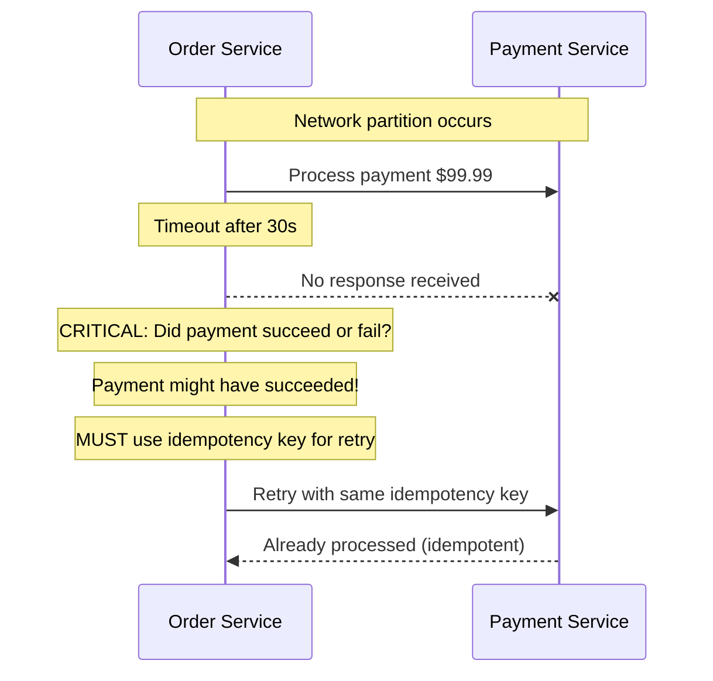
```mermaid
sequenceDiagram
    participant O as Order Service
    participant P as Payment Service
    
    Note over O,P: Network partition occurs
    O->>P: Process payment $99.99
    Note over O: Timeout after 30s
    O--xP: No response received
    
    Note over O: CRITICAL: Did payment succeed or fail?
    Note over O: Payment might have succeeded!
    Note over O: MUST use idempotency key for retry
    
    O->>P: Retry with same idempotency key
    P-->>O: Already processed (idempotent)
```

### Compensation Can Fail Too
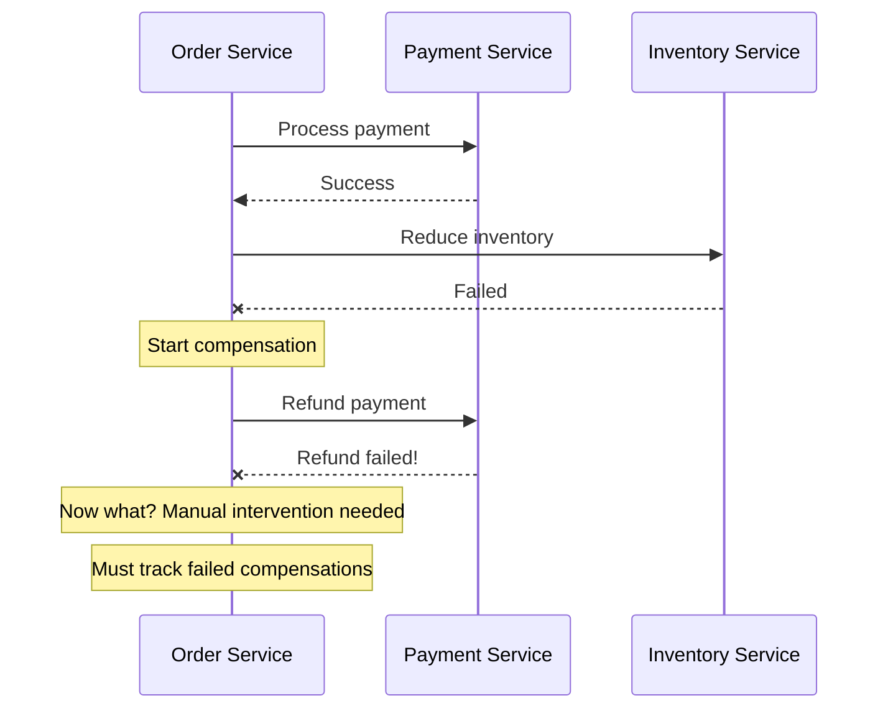
```mermaid
sequenceDiagram
    participant O as Order Service
    participant P as Payment Service
    participant I as Inventory Service
    
    O->>P: Process payment
    P-->>O: Success
    O->>I: Reduce inventory
    I--xO: Failed
    
    Note over O: Start compensation
    O->>P: Refund payment
    P--xO: Refund failed!
    
    Note over O: Now what? Manual intervention needed
    Note over O: Must track failed compensations
```

## Key Insights from Enhanced Diagrams

1. **2PC's Achilles Heel**: Coordinator failure causes system-wide blocking
2. **Saga's Race Condition Problem**: Lack of isolation leads to data corruption
3. **2PS's Sweet Spot**: Fastest failure detection through single synchronization point
4. **3PS's Innovation**: Read-only validation phase enables safe parallel progress
5. **1.5PS's Pragmatism**: Explicitly separates what must succeed from what's nice-to-have
6. **0.5PS's Trade-off**: Ultimate speed at the cost of consistency guarantees

The timing analysis reveals that more phases don't necessarily mean slower - 3PS can complete faster than sequential Saga despite having more phases, due to full parallelism.