# Distributed Transaction Patterns - Enhanced E-commerce Sequence Diagrams

## Navigation
- [Main Guide](dxp-01-guide.md) - Start here
- [Theoretical Foundations](dxp-04-theoretical-foundations.md) - Why these patterns exist
- [Technical Deep Dive](dxp-02-deep-dive.md) - Implementation details
- **You are here**: Sequence Diagrams
- [Pattern Modifiers](dxp-05-pattern-modifiers.md) - Optional enhancements
- [Evolution Guide](dxp-06-evolution-guide.md) - Growing with patterns

## Scenario: Customer Order Processing
A customer places an order that requires:
1. Payment processing ($99.99)
2. Inventory reduction (1 item)
3. Shipping arrangement
4. Order confirmation

---

## 2PC (Two-Phase Commit)

### Success Path
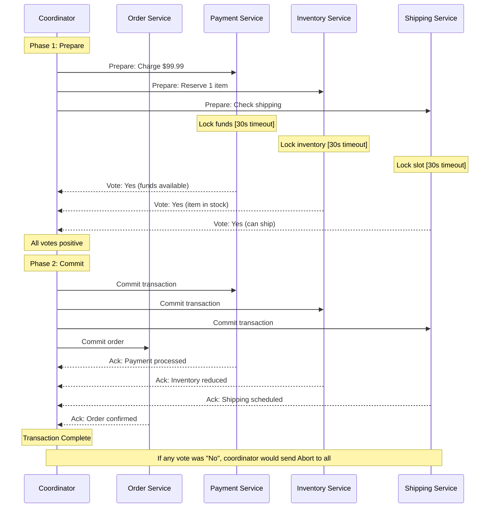
```mermaid
sequenceDiagram
    participant C as Coordinator
    participant O as Order Service
    participant P as Payment Service
    participant I as Inventory Service
    participant S as Shipping Service

    Note over C: Phase 1: Prepare
    C->>P: Prepare: Charge $99.99
    C->>I: Prepare: Reserve 1 item
    C->>S: Prepare: Check shipping
    
    Note over P: Lock funds [30s timeout]
    Note over I: Lock inventory [30s timeout]
    Note over S: Lock slot [30s timeout]
    
    P-->>C: Vote: Yes (funds available)
    I-->>C: Vote: Yes (item in stock)
    S-->>C: Vote: Yes (can ship)
    
    Note over C: All votes positive
    Note over C: Phase 2: Commit
    
    C->>P: Commit transaction
    C->>I: Commit transaction
    C->>S: Commit transaction
    C->>O: Commit order
    
    P-->>C: Ack: Payment processed
    I-->>C: Ack: Inventory reduced
    S-->>C: Ack: Shipping scheduled
    O-->>C: Ack: Order confirmed

    Note over C: Transaction Complete
    
    Note over C,S: If any vote was "No", coordinator would send Abort to all
```

### Coordinator Failure Scenario
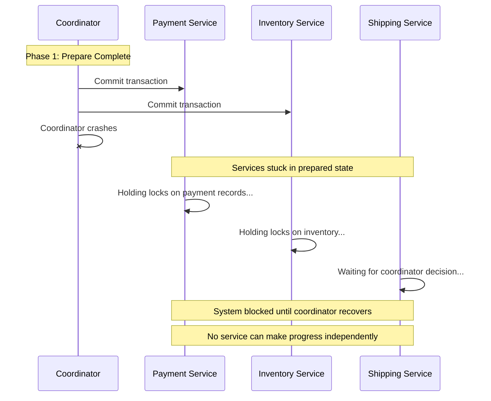
```mermaid
sequenceDiagram
    participant C as Coordinator
    participant P as Payment Service
    participant I as Inventory Service
    participant S as Shipping Service

    Note over C: Phase 1: Prepare Complete
    C->>P: Commit transaction
    C->>I: Commit transaction
    C-xC: Coordinator crashes
    
    Note over P,S: Services stuck in prepared state
    P->>P: Holding locks on payment records...
    I->>I: Holding locks on inventory...
    S->>S: Waiting for coordinator decision...
    
    Note over P,S: System blocked until coordinator recovers
    Note over P,S: No service can make progress independently
```

**Characteristics:**
- Synchronous, blocking
- All participants must be available
- Strong consistency
- Coordinator is single point of failure
- System-wide blocking on coordinator failure

---

## Saga Pattern

### Success Path
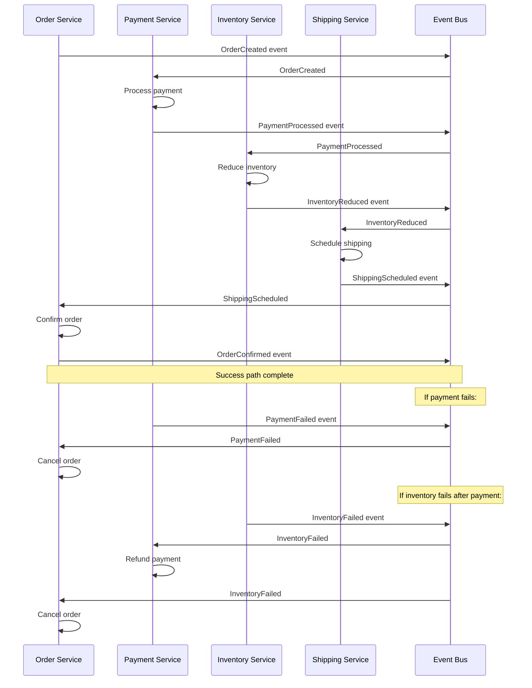
```mermaid
sequenceDiagram
    participant O as Order Service
    participant P as Payment Service
    participant I as Inventory Service
    participant S as Shipping Service
    participant E as Event Bus

    O->>E: OrderCreated event
    
    E->>P: OrderCreated
    P->>P: Process payment
    P->>E: PaymentProcessed event
    
    E->>I: PaymentProcessed
    I->>I: Reduce inventory
    I->>E: InventoryReduced event
    
    E->>S: InventoryReduced
    S->>S: Schedule shipping
    S->>E: ShippingScheduled event
    
    E->>O: ShippingScheduled
    O->>O: Confirm order
    O->>E: OrderConfirmed event

    Note over O,E: Success path complete

    Note over E: If payment fails:
    P->>E: PaymentFailed event
    E->>O: PaymentFailed
    O->>O: Cancel order
    
    Note over E: If inventory fails after payment:
    I->>E: InventoryFailed event
    E->>P: InventoryFailed
    P->>P: Refund payment
    E->>O: InventoryFailed
    O->>O: Cancel order
```

### Race Condition Scenario
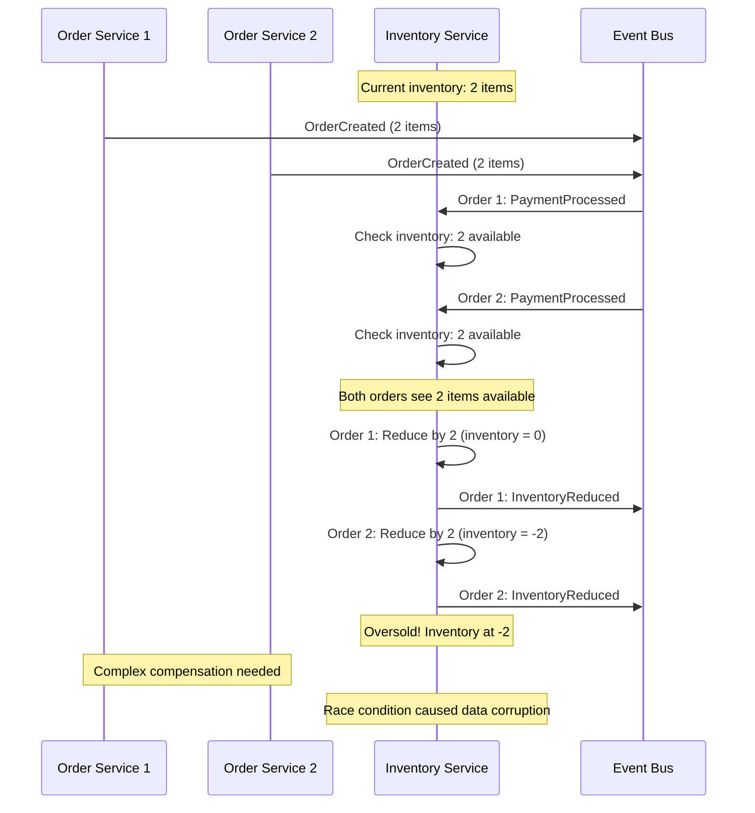
```mermaid
sequenceDiagram
    participant O1 as Order Service 1
    participant O2 as Order Service 2
    participant I as Inventory Service
    participant E as Event Bus

    Note over I: Current inventory: 2 items
    
    O1->>E: OrderCreated (2 items)
    O2->>E: OrderCreated (2 items)
    
    E->>I: Order 1: PaymentProcessed
    I->>I: Check inventory: 2 available
    E->>I: Order 2: PaymentProcessed
    I->>I: Check inventory: 2 available
    
    Note over I: Both orders see 2 items available
    
    I->>I: Order 1: Reduce by 2 (inventory = 0)
    I->>E: Order 1: InventoryReduced
    
    I->>I: Order 2: Reduce by 2 (inventory = -2)
    I->>E: Order 2: InventoryReduced
    
    Note over I: Oversold! Inventory at -2
    Note over O1,O2: Complex compensation needed
    Note over I: Race condition caused data corruption
```

**Characteristics:**
- Asynchronous, event-driven
- Services are loosely coupled
- Eventual consistency
- Complex compensation logic
- No isolation between concurrent sagas
- Vulnerable to race conditions

---

## 0.5PS (Zero-Point-Five Phase Saga)

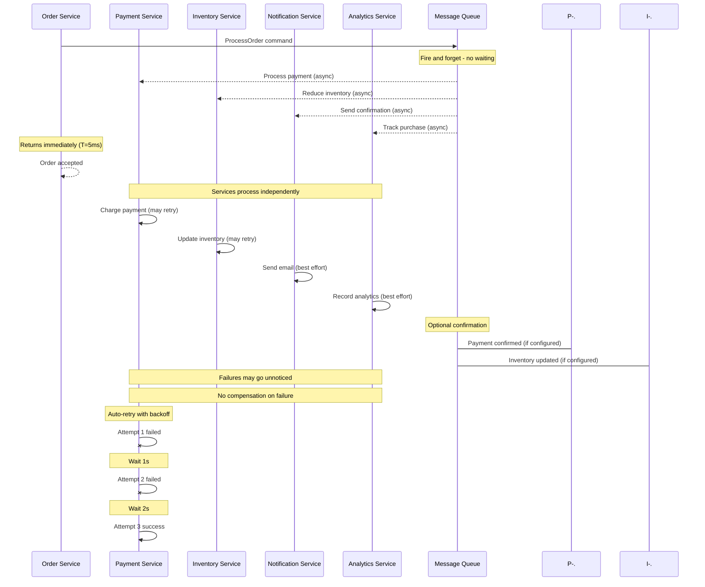
```mermaid
sequenceDiagram
    participant O as Order Service
    participant P as Payment Service
    participant I as Inventory Service
    participant N as Notification Service
    participant A as Analytics Service
    participant Q as Message Queue

    O->>Q: ProcessOrder command
    
    Note over Q: Fire and forget - no waiting
    Q-->>P: Process payment (async)
    Q-->>I: Reduce inventory (async)
    Q-->>N: Send confirmation (async)
    Q-->>A: Track purchase (async)
    
    Note over O: Returns immediately (T=5ms)
    O-->>O: Order accepted

    Note over P,A: Services process independently
    P->>P: Charge payment (may retry)
    I->>I: Update inventory (may retry)
    N->>N: Send email (best effort)
    A->>A: Record analytics (best effort)

    Note over Q: Optional confirmation
    P-.->Q: Payment confirmed (if configured)
    I-.->Q: Inventory updated (if configured)
    
    Note over P,A: Failures may go unnoticed
    Note over P,A: No compensation on failure
    
    Note over P: Auto-retry with backoff
    P-xP: Attempt 1 failed
    Note over P: Wait 1s
    P-xP: Attempt 2 failed
    Note over P: Wait 2s
    P->>P: Attempt 3 success
```

**Characteristics:**
- True fire-and-forget
- No blocking, returns immediately
- Best effort delivery
- Suitable for non-critical operations
- Silent failures possible
- Fastest response time

---

## 1.5PS (One-Point-Five Phase Saga)

### Standard Flow with Decision Points
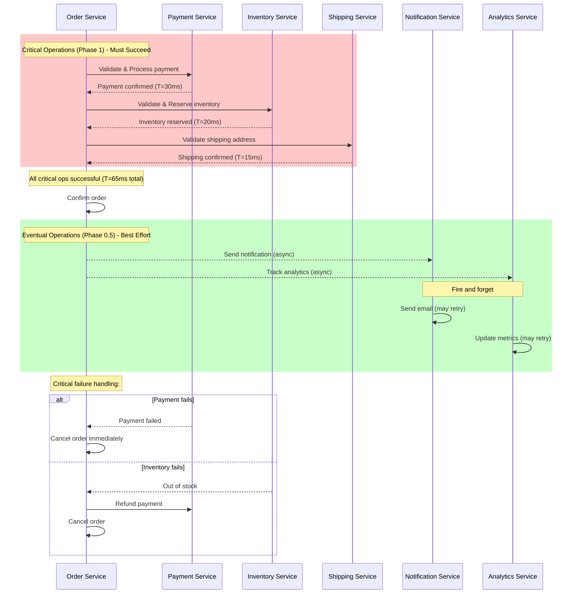
```mermaid
sequenceDiagram
    participant O as Order Service
    participant P as Payment Service
    participant I as Inventory Service
    participant S as Shipping Service
    participant N as Notification Service
    participant A as Analytics Service

    rect rgb(255, 200, 200)
        Note over O: Critical Operations (Phase 1) - Must Succeed
        O->>P: Validate & Process payment
        P-->>O: Payment confirmed (T=30ms)
        
        O->>I: Validate & Reserve inventory
        I-->>O: Inventory reserved (T=20ms)
        
        O->>S: Validate shipping address
        S-->>O: Shipping confirmed (T=15ms)
    end

    Note over O: All critical ops successful (T=65ms total)
    O->>O: Confirm order

    rect rgb(200, 255, 200)
        Note over O: Eventual Operations (Phase 0.5) - Best Effort
        O-->>N: Send notification (async)
        O-->>A: Track analytics (async)
        
        Note over N,A: Fire and forget
        N->>N: Send email (may retry)
        A->>A: Update metrics (may retry)
    end

    Note over O: Critical failure handling:
    alt Payment fails
        P-->>O: Payment failed
        O->>O: Cancel order immediately
    else Inventory fails
        I-->>O: Out of stock
        O->>P: Refund payment
        O->>O: Cancel order
    end
```

**Characteristics:**
- Critical operations are synchronous
- Non-critical operations are fire-and-forget
- Mixed consistency model
- Practical for real systems
- Clear separation of concerns
- Fast failure for critical operations

---

## 2PS (Two-Phase Saga)

### Standard Flow with Timing and Timeouts
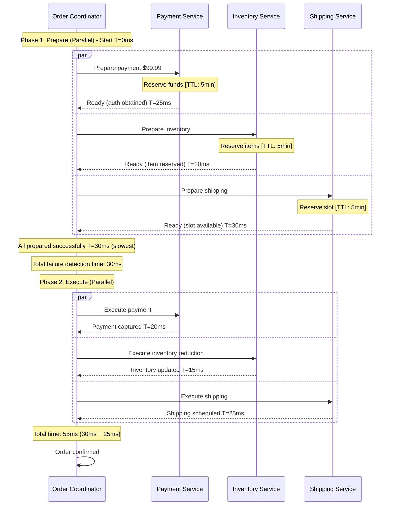
```mermaid
sequenceDiagram
    participant O as Order Coordinator
    participant P as Payment Service
    participant I as Inventory Service
    participant S as Shipping Service

    Note over O: Phase 1: Prepare (Parallel) - Start T=0ms
    par
        O->>P: Prepare payment $99.99
        Note over P: Reserve funds [TTL: 5min]
        P-->>O: Ready (auth obtained) T=25ms
    and
        O->>I: Prepare inventory
        Note over I: Reserve items [TTL: 5min]
        I-->>O: Ready (item reserved) T=20ms
    and
        O->>S: Prepare shipping
        Note over S: Reserve slot [TTL: 5min]
        S-->>O: Ready (slot available) T=30ms
    end

    Note over O: All prepared successfully T=30ms (slowest)
    Note over O: Total failure detection time: 30ms
    
    Note over O: Phase 2: Execute (Parallel)
    par
        O->>P: Execute payment
        P-->>O: Payment captured T=20ms
    and
        O->>I: Execute inventory reduction
        I-->>O: Inventory updated T=15ms
    and
        O->>S: Execute shipping
        S-->>O: Shipping scheduled T=25ms
    end

    Note over O: Total time: 55ms (30ms + 25ms)
    O->>O: Order confirmed
```

### Failure Detection Comparison
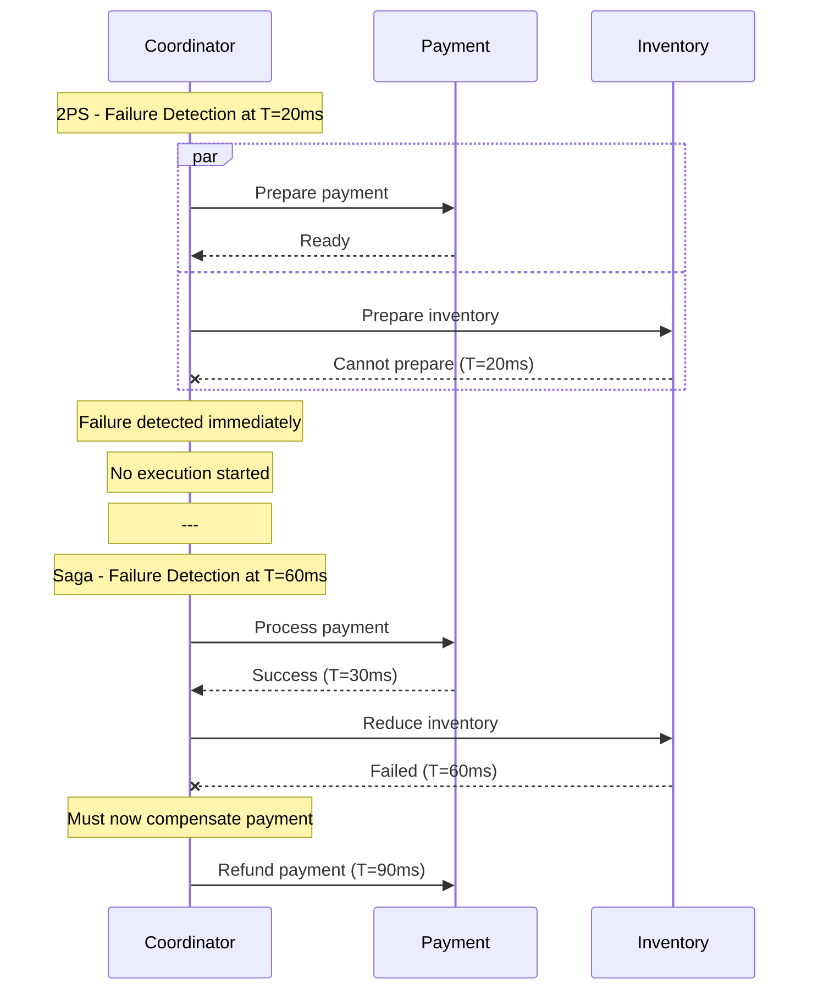
```mermaid
sequenceDiagram
    participant O as Coordinator
    participant P as Payment
    participant I as Inventory
    
    Note over O: 2PS - Failure Detection at T=20ms
    par
        O->>P: Prepare payment
        P-->>O: Ready
    and
        O->>I: Prepare inventory
        I--xO: Cannot prepare (T=20ms)
    end
    Note over O: Failure detected immediately
    Note over O: No execution started
    
    Note over O: ---
    
    Note over O: Saga - Failure Detection at T=60ms
    O->>P: Process payment
    P-->>O: Success (T=30ms)
    O->>I: Reduce inventory
    I--xO: Failed (T=60ms)
    Note over O: Must now compensate payment
    O->>P: Refund payment (T=90ms)
```

**Characteristics:**
- Two distinct phases
- Parallel execution within phases
- Early failure detection in prepare
- Simpler than 3PS
- Fastest failure detection (single gate)

---

## 2PS with Optional Verification (2PS-OV)

### Standard Flow with Optional Status Check
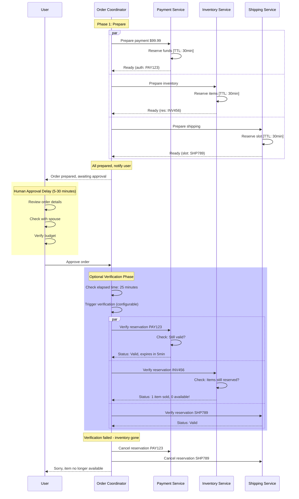
```mermaid
sequenceDiagram
    participant U as User
    participant O as Order Coordinator
    participant P as Payment Service
    participant I as Inventory Service
    participant S as Shipping Service

    Note over O: Phase 1: Prepare
    par
        O->>P: Prepare payment $99.99
        P->>P: Reserve funds [TTL: 30min]
        P-->>O: Ready (auth: PAY123)
    and
        O->>I: Prepare inventory
        I->>I: Reserve items [TTL: 30min]
        I-->>O: Ready (res: INV456)
    and
        O->>S: Prepare shipping
        S->>S: Reserve slot [TTL: 30min]
        S-->>O: Ready (slot: SHP789)
    end

    Note over O: All prepared, notify user
    O-->>U: Order prepared, awaiting approval
    
    rect rgb(255, 255, 200)
        Note over U: Human Approval Delay (5-30 minutes)
        U->>U: Review order details
        U->>U: Check with spouse
        U->>U: Verify budget
    end
    
    U->>O: Approve order
    
    rect rgb(200, 200, 255)
        Note over O: Optional Verification Phase
        O->>O: Check elapsed time: 25 minutes
        O->>O: Trigger verification (configurable)
        
        par
            O->>P: Verify reservation PAY123
            P->>P: Check: Still valid?
            P-->>O: Status: Valid, expires in 5min
        and
            O->>I: Verify reservation INV456
            I->>I: Check: Items still reserved?
            I-->>O: Status: 1 item sold, 0 available!
        and
            O->>S: Verify reservation SHP789
            S-->>O: Status: Valid
        end
    end
    
    Note over O: Verification failed - inventory gone
    O->>P: Cancel reservation PAY123
    O->>S: Cancel reservation SHP789
    O-->>U: Sorry, item no longer available
```

### Decision Points for Verification
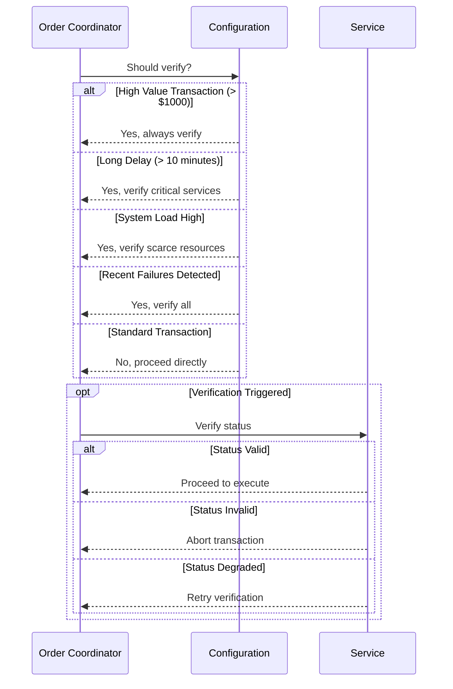
```mermaid
sequenceDiagram
    participant O as Order Coordinator
    participant C as Configuration
    participant S as Service

    O->>C: Should verify?
    
    alt High Value Transaction (> $1000)
        C-->>O: Yes, always verify
    else Long Delay (> 10 minutes)
        C-->>O: Yes, verify critical services
    else System Load High
        C-->>O: Yes, verify scarce resources
    else Recent Failures Detected
        C-->>O: Yes, verify all
    else Standard Transaction
        C-->>O: No, proceed directly
    end
    
    opt Verification Triggered
        O->>S: Verify status
        alt Status Valid
            S-->>O: Proceed to execute
        else Status Invalid
            S-->>O: Abort transaction
        else Status Degraded
            S-->>O: Retry verification
        end
    end
```

---

## 3PS (Three-Phase Saga)

### Standard Flow with Independent Progress and Timeouts
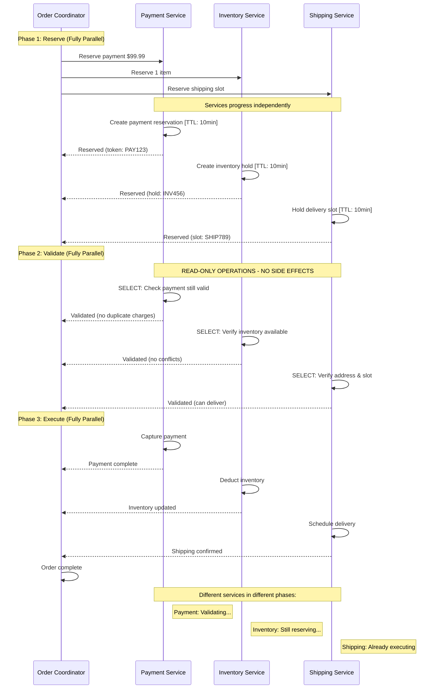
```mermaid
sequenceDiagram
    participant O as Order Coordinator
    participant P as Payment Service
    participant I as Inventory Service
    participant S as Shipping Service

    Note over O: Phase 1: Reserve (Fully Parallel)
    
    O->>P: Reserve payment $99.99
    O->>I: Reserve 1 item
    O->>S: Reserve shipping slot

    Note over P,S: Services progress independently
    
    P->>P: Create payment reservation [TTL: 10min]
    P-->>O: Reserved (token: PAY123)
    
    I->>I: Create inventory hold [TTL: 10min]
    I-->>O: Reserved (hold: INV456)
    
    S->>S: Hold delivery slot [TTL: 10min]
    S-->>O: Reserved (slot: SHIP789)

    Note over O: Phase 2: Validate (Fully Parallel)
    Note over P,S: READ-ONLY OPERATIONS - NO SIDE EFFECTS
    
    P->>P: SELECT: Check payment still valid
    P-->>O: Validated (no duplicate charges)
    
    I->>I: SELECT: Verify inventory available
    I-->>O: Validated (no conflicts)
    
    S->>S: SELECT: Verify address & slot
    S-->>O: Validated (can deliver)

    Note over O: Phase 3: Execute (Fully Parallel)
    
    P->>P: Capture payment
    P-->>O: Payment complete
    
    I->>I: Deduct inventory
    I-->>O: Inventory updated
    
    S->>S: Schedule delivery
    S-->>O: Shipping confirmed

    O->>O: Order complete

    Note over P,S: Different services in different phases:
    Note right of P: Payment: Validating...
    Note right of I: Inventory: Still reserving...
    Note right of S: Shipping: Already executing
```

### Resource State Tracking with Expiration
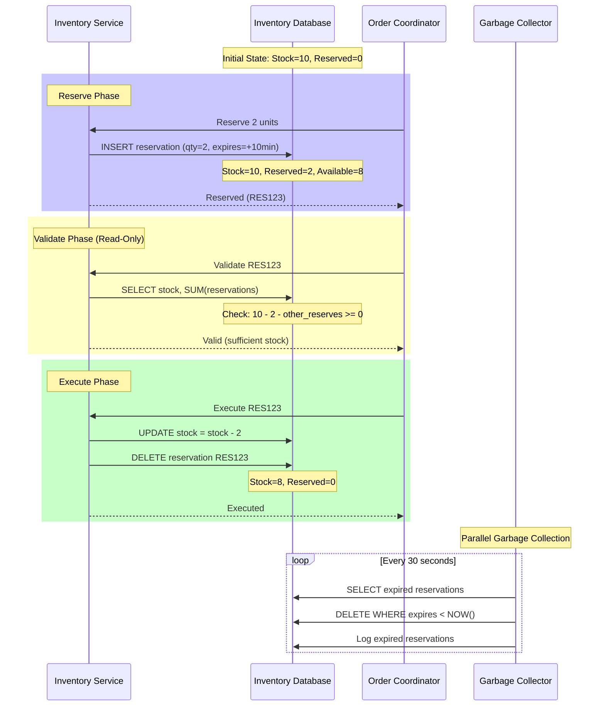
```mermaid
sequenceDiagram
    participant I as Inventory Service
    participant DB as Inventory Database
    participant O as Order Coordinator
    participant GC as Garbage Collector

    Note over DB: Initial State: Stock=10, Reserved=0
    
    rect rgb(200, 200, 255)
        Note over I: Reserve Phase
        O->>I: Reserve 2 units
        I->>DB: INSERT reservation (qty=2, expires=+10min)
        Note over DB: Stock=10, Reserved=2, Available=8
        I-->>O: Reserved (RES123)
    end
    
    rect rgb(255, 255, 200)
        Note over I: Validate Phase (Read-Only)
        O->>I: Validate RES123
        I->>DB: SELECT stock, SUM(reservations)
        Note over DB: Check: 10 - 2 - other_reserves >= 0
        I-->>O: Valid (sufficient stock)
    end
    
    rect rgb(200, 255, 200)
        Note over I: Execute Phase
        O->>I: Execute RES123
        I->>DB: UPDATE stock = stock - 2
        I->>DB: DELETE reservation RES123
        Note over DB: Stock=8, Reserved=0
        I-->>O: Executed
    end
    
    Note over GC: Parallel Garbage Collection
    loop Every 30 seconds
        GC->>DB: SELECT expired reservations
        GC->>DB: DELETE WHERE expires < NOW()
        GC->>DB: Log expired reservations
    end
```

### Validation Catches Race Condition
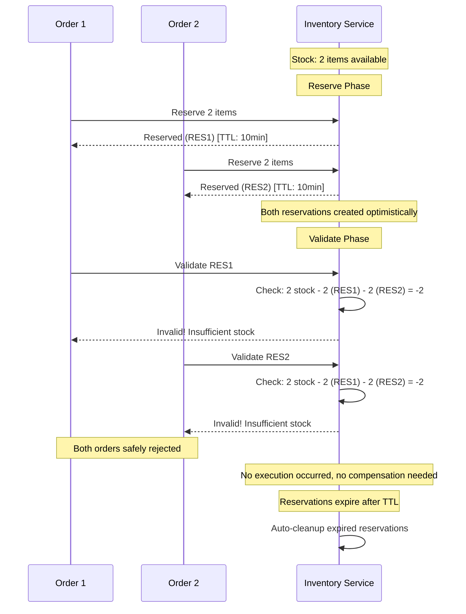
```mermaid
sequenceDiagram
    participant O1 as Order 1
    participant O2 as Order 2
    participant I as Inventory Service

    Note over I: Stock: 2 items available
    
    Note over I: Reserve Phase
    O1->>I: Reserve 2 items
    I-->>O1: Reserved (RES1) [TTL: 10min]
    O2->>I: Reserve 2 items
    I-->>O2: Reserved (RES2) [TTL: 10min]
    
    Note over I: Both reservations created optimistically
    
    Note over I: Validate Phase
    O1->>I: Validate RES1
    I->>I: Check: 2 stock - 2 (RES1) - 2 (RES2) = -2
    I-->>O1: Invalid! Insufficient stock
    
    O2->>I: Validate RES2
    I->>I: Check: 2 stock - 2 (RES1) - 2 (RES2) = -2
    I-->>O2: Invalid! Insufficient stock
    
    Note over O1,O2: Both orders safely rejected
    Note over I: No execution occurred, no compensation needed
    
    Note over I: Reservations expire after TTL
    I->>I: Auto-cleanup expired reservations
```

**Characteristics:**
- Three distinct phases for safety
- Fully parallel - services progress independently
- Validation catches race conditions
- Most complex coordination
- "Distributed ACID" without locks
- Read-only validation phase critical for safety

---

## Geographic Distribution Patterns

### Multi-Region 3PS with Local Reservations
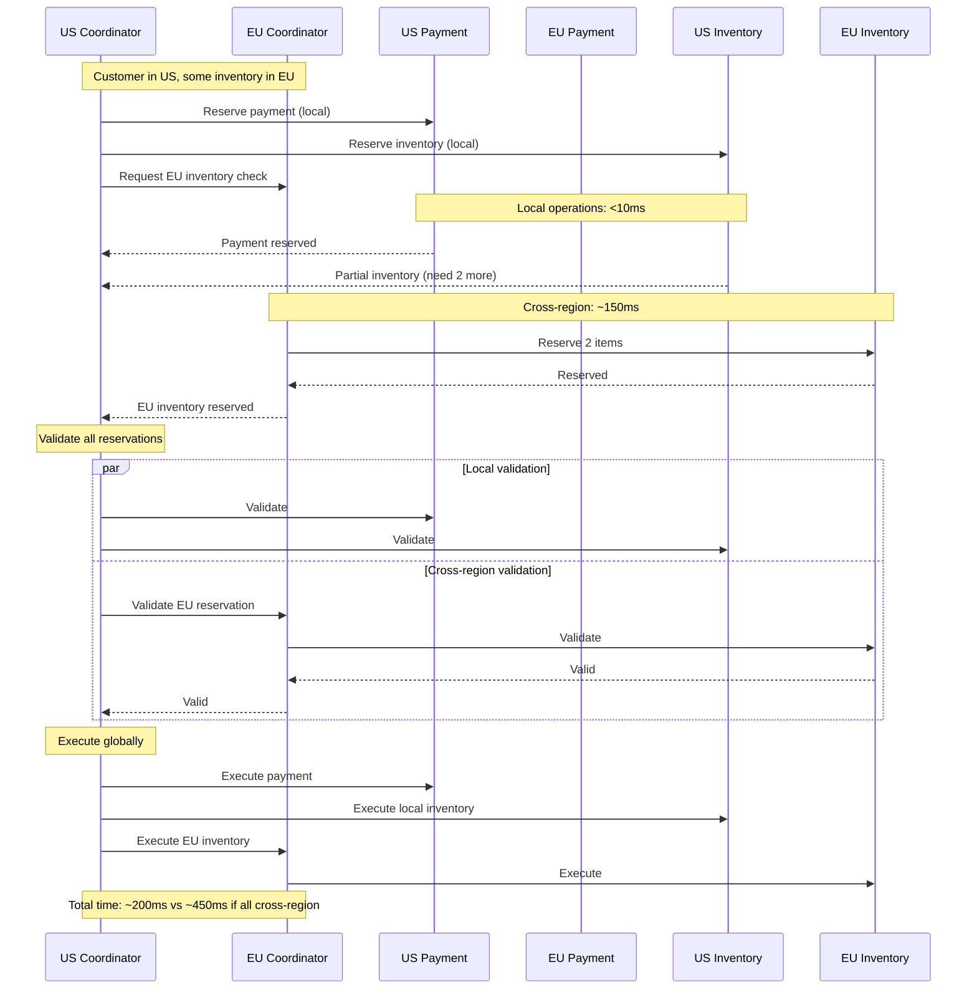
```mermaid
sequenceDiagram
    participant UC as US Coordinator
    participant EC as EU Coordinator
    participant UP as US Payment
    participant EP as EU Payment
    participant UI as US Inventory
    participant EI as EU Inventory

    Note over UC,EC: Customer in US, some inventory in EU
    
    UC->>UP: Reserve payment (local)
    UC->>UI: Reserve inventory (local)
    UC->>EC: Request EU inventory check
    
    Note over UP,UI: Local operations: <10ms
    UP-->>UC: Payment reserved
    UI-->>UC: Partial inventory (need 2 more)
    
    Note over EC,EI: Cross-region: ~150ms
    EC->>EI: Reserve 2 items
    EI-->>EC: Reserved
    EC-->>UC: EU inventory reserved
    
    Note over UC: Validate all reservations
    par Local validation
        UC->>UP: Validate
        UC->>UI: Validate
    and Cross-region validation
        UC->>EC: Validate EU reservation
        EC->>EI: Validate
        EI-->>EC: Valid
        EC-->>UC: Valid
    end
    
    Note over UC: Execute globally
    UC->>UP: Execute payment
    UC->>UI: Execute local inventory
    UC->>EC: Execute EU inventory
    EC->>EI: Execute
    
    Note over UC,EC: Total time: ~200ms vs ~450ms if all cross-region
```

### Regional Affinity in Action
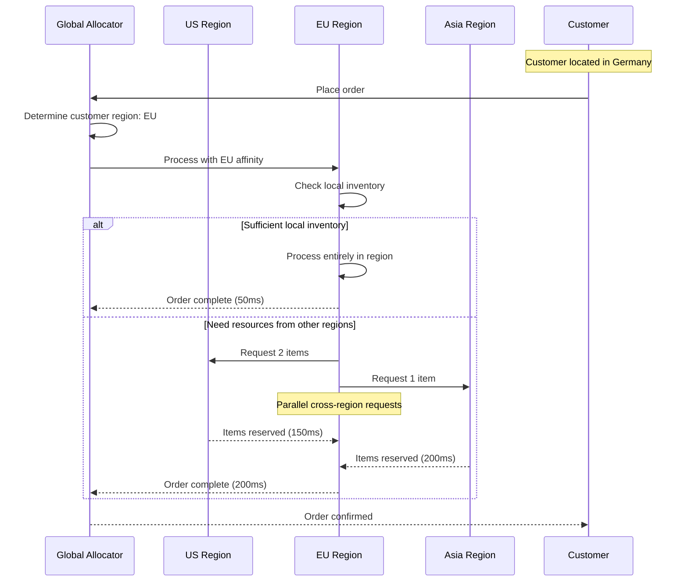
```mermaid
sequenceDiagram
    participant GA as Global Allocator
    participant US as US Region
    participant EU as EU Region
    participant AS as Asia Region
    participant C as Customer

    Note over C: Customer located in Germany
    
    C->>GA: Place order
    GA->>GA: Determine customer region: EU
    
    GA->>EU: Process with EU affinity
    
    EU->>EU: Check local inventory
    alt Sufficient local inventory
        EU->>EU: Process entirely in region
        EU-->>GA: Order complete (50ms)
    else Need resources from other regions
        EU->>US: Request 2 items
        EU->>AS: Request 1 item
        Note over EU: Parallel cross-region requests
        US-->>EU: Items reserved (150ms)
        AS-->>EU: Items reserved (200ms)
        EU-->>GA: Order complete (200ms)
    end
    
    GA-->>C: Order confirmed
```

---

## Pattern Evolution

### Evolution from Saga to 2PS
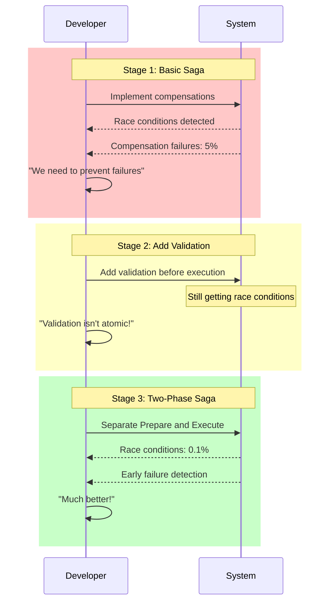
```mermaid
sequenceDiagram
    participant D as Developer
    participant S as System
    
    rect rgb(255, 200, 200)
        Note over D,S: Stage 1: Basic Saga
        D->>S: Implement compensations
        S-->>D: Race conditions detected
        S-->>D: Compensation failures: 5%
        D->>D: "We need to prevent failures"
    end
    
    rect rgb(255, 255, 200)
        Note over D,S: Stage 2: Add Validation
        D->>S: Add validation before execution
        Note over S: Still getting race conditions
        D->>D: "Validation isn't atomic!"
    end
    
    rect rgb(200, 255, 200)
        Note over D,S: Stage 3: Two-Phase Saga
        D->>S: Separate Prepare and Execute
        S-->>D: Race conditions: 0.1%
        S-->>D: Early failure detection
        D->>D: "Much better!"
    end
```

### Evolution from 2PS to 3PS
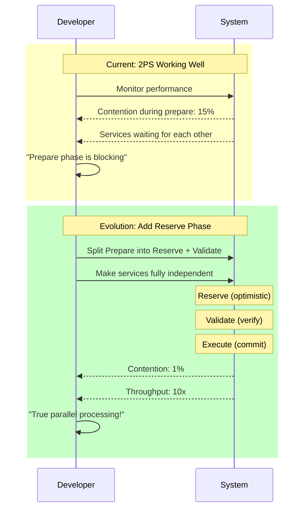
```mermaid
sequenceDiagram
    participant D as Developer
    participant S as System
    
    rect rgb(255, 255, 200)
        Note over D,S: Current: 2PS Working Well
        D->>S: Monitor performance
        S-->>D: Contention during prepare: 15%
        S-->>D: Services waiting for each other
        D->>D: "Prepare phase is blocking"
    end
    
    rect rgb(200, 255, 200)
        Note over D,S: Evolution: Add Reserve Phase
        D->>S: Split Prepare into Reserve + Validate
        D->>S: Make services fully independent
        Note over S: Reserve (optimistic)
        Note over S: Validate (verify)
        Note over S: Execute (commit)
        S-->>D: Contention: 1%
        S-->>D: Throughput: 10x
        D->>D: "True parallel processing!"
    end
```

### Where Pattern Modifiers Fit
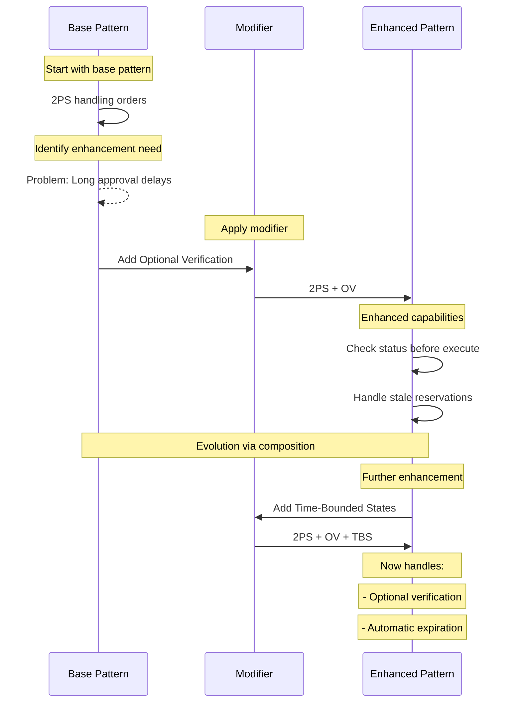
```mermaid
sequenceDiagram
    participant B as Base Pattern
    participant M as Modifier
    participant E as Enhanced Pattern
    
    Note over B: Start with base pattern
    B->>B: 2PS handling orders
    
    Note over B: Identify enhancement need
    B-->>B: Problem: Long approval delays
    
    Note over M: Apply modifier
    B->>M: Add Optional Verification
    M->>E: 2PS + OV
    
    Note over E: Enhanced capabilities
    E->>E: Check status before execute
    E->>E: Handle stale reservations
    
    Note over B,E: Evolution via composition
    
    Note over E: Further enhancement
    E->>M: Add Time-Bounded States
    M->>E: 2PS + OV + TBS
    
    Note over E: Now handles:
    Note over E: - Optional verification
    Note over E: - Automatic expiration
```

---

## Recovery Flows

### 2PS Recovery Flow
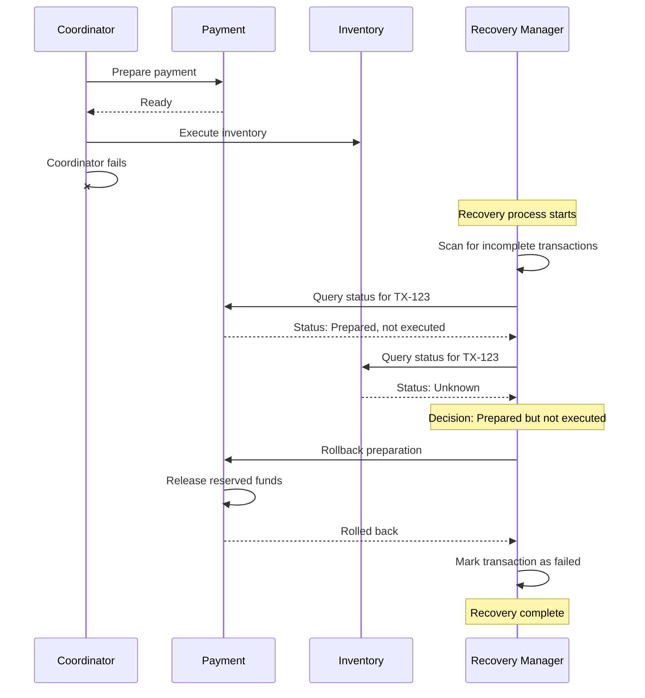
```mermaid
sequenceDiagram
    participant C as Coordinator
    participant P as Payment
    participant I as Inventory
    participant R as Recovery Manager
    
    C->>P: Prepare payment
    P-->>C: Ready
    C->>I: Execute inventory
    C-xC: Coordinator fails
    
    Note over R: Recovery process starts
    R->>R: Scan for incomplete transactions
    R->>P: Query status for TX-123
    P-->>R: Status: Prepared, not executed
    R->>I: Query status for TX-123
    I-->>R: Status: Unknown
    
    Note over R: Decision: Prepared but not executed
    R->>P: Rollback preparation
    P->>P: Release reserved funds
    P-->>R: Rolled back
    
    R->>R: Mark transaction as failed
    Note over R: Recovery complete
```

### 3PS Self-Healing Recovery
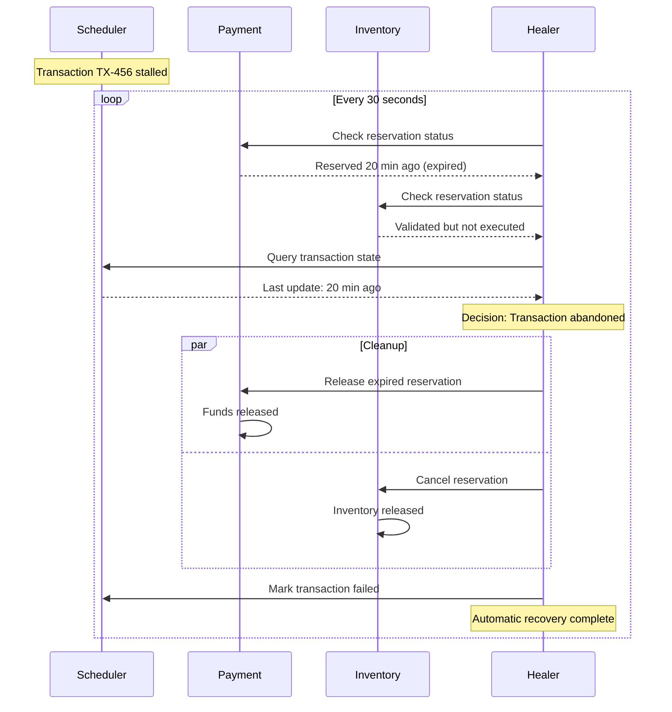
```mermaid
sequenceDiagram
    participant S as Scheduler
    participant P as Payment
    participant I as Inventory
    participant H as Healer
    
    Note over S: Transaction TX-456 stalled
    
    loop Every 30 seconds
        H->>P: Check reservation status
        P-->>H: Reserved 20 min ago (expired)
        
        H->>I: Check reservation status  
        I-->>H: Validated but not executed
        
        H->>S: Query transaction state
        S-->>H: Last update: 20 min ago
        
        Note over H: Decision: Transaction abandoned
        
        par Cleanup
            H->>P: Release expired reservation
            P->>P: Funds released
        and
            H->>I: Cancel reservation
            I->>I: Inventory released
        end
        
        H->>S: Mark transaction failed
        Note over H: Automatic recovery complete
    end
```

---

## Pattern Comparison

### Timing and Performance

```mermaid
gantt
    title Operation Latency Comparison
    dateFormat X
    axisFormat %Lms
    
    section 2PC
    Prepare Phase     :2pc1, 0, 50
    Wait for votes    :milestone, 50, 0
    Commit Phase      :2pc2, after 2pc1, 50
    
    section Saga
    Payment          :saga1, 0, 30
    Inventory        :saga2, after saga1, 30
    Shipping         :saga3, after saga2, 30
    
    section 2PS
    Prepare (parallel) :2ps1, 0, 30
    Wait barrier      :milestone, 30, 0
    Execute (parallel) :2ps2, after 2ps1, 25
    
    section 3PS
    Reserve          :3ps1, 0, 20
    Validate         :3ps2, 15, 20
    Execute          :3ps3, 30, 20
    
    section 1.5PS
    Critical ops     :15ps1, 0, 65
    Eventual ops     :15ps2, 0, 5
    
    section 2PS-OV
    Prepare          :2psov1, 0, 30
    Verify (optional) :2psov2, 30, 10
    Execute          :2psov3, 40, 25
```

### Characteristics Matrix

| Pattern | Phases | Parallelism | Consistency | Failure Detection | Complexity | Use Case |
|---------|--------|-------------|-------------|-------------------|------------|----------|
| 2PC | 2 | Within phase | Strong | Fast (blocking) | Medium | Financial transactions |
| Saga | 1 | Sequential/Parallel | Eventual | During execution | High (compensations) | Long-running workflows |
| 0.5PS | 0.5 | Fully parallel | None | Poor/Never | Lowest | Analytics, notifications |
| 1.5PS | 1.5 | Mixed | Mixed | Fast for critical | Low | Real-world systems |
| 2PS | 2 | Within phase | Moderate | Fastest (30ms) | Medium | General purpose |
| 2PS-OV | 2.5 | Within phase | Moderate+ | Configurable | Medium+ | Human approval flows |
| 3PS | 3 | Fully parallel | Strong-ish | Good | Highest | Complex microservices |

## Reality Check: Common Pitfalls

### Network Timeouts Don't Equal Failures
```mermaid
sequenceDiagram
    participant O as Order Service
    participant P as Payment Service
    
    Note over O,P: Network partition occurs
    O->>P: Process payment $99.99
    Note over O: Timeout after 30s
    O--xP: No response received
    
    Note over O: CRITICAL: Did payment succeed or fail?
    Note over O: Payment might have succeeded!
    Note over O: MUST use idempotency key for retry
    
    O->>P: Retry with same idempotency key
    P-->>O: Already processed (idempotent)
```

### Compensation Can Fail Too
```mermaid
sequenceDiagram
    participant O as Order Service
    participant P as Payment Service
    participant I as Inventory Service
    
    O->>P: Process payment
    P-->>O: Success
    O->>I: Reduce inventory
    I--xO: Failed
    
    Note over O: Start compensation
    O->>P: Refund payment
    P--xO: Refund failed!
    
    Note over O: Now what? Manual intervention needed
    Note over O: Must track failed compensations
```

## Key Insights from Enhanced Diagrams

1. **Timeout Management**: Every reservation needs TTL for automatic cleanup
2. **Optional Verification**: 2PS-OV shows how human delays can be handled safely
3. **Geographic Optimization**: Regional affinity can dramatically reduce latency
4. **Pattern Evolution**: Natural progression as systems grow and learn
5. **Self-Healing**: Automatic recovery through expiration and garbage collection
6. **Modifier Integration**: Patterns can be enhanced without changing core flow

The timing analysis reveals that more phases don't necessarily mean slower - 3PS can complete faster than sequential Saga despite having more phases, due to full parallelism. The addition of modifiers like Optional Verification and Geographic Affinity shows how patterns can be adapted to real-world requirements.