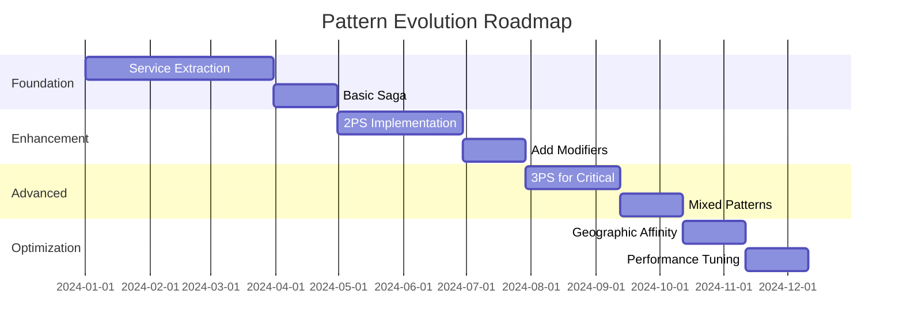

# Distributed Transaction Patterns: Evolution Guide

## Table of Contents
1. [Introduction](#introduction)
2. [The Natural Evolution Path](#natural-evolution)
3. [Recognizing Growth Signals](#growth-signals)
4. [Migration Strategies](#migration-strategies)
5. [Pattern Mixing Strategies](#pattern-mixing)
6. [Case Studies](#case-studies)
7. [Anti-Patterns and Pitfalls](#anti-patterns)
8. [Evolution Roadmap](#evolution-roadmap)
9. [Tooling and Automation](#tooling)
10. [Conclusions](#conclusions)

---

## 1. Introduction {#introduction}

Distributed transaction patterns are not static choices. As systems grow, requirements change, and teams learn, the optimal pattern often evolves. This guide helps you navigate that evolution, recognizing when to change patterns and how to migrate safely.

### The Evolution Mindset

Evolution in distributed transaction patterns is:
- **Natural**: Systems grow more complex over time
- **Incremental**: Small steps are safer than big leaps
- **Reversible**: Sometimes you need to step back
- **Mixed**: Different parts may need different patterns

### Why Evolution Matters

Starting with the "perfect" pattern is impossible because:
1. Requirements are discovered, not predicted
2. Scale changes everything
3. Team expertise grows
4. Business priorities shift

---

## 2. The Natural Evolution Path {#natural-evolution}

### The Typical Journey

Most teams follow a predictable path:

```
Simple Transactions
        ↓
 Monolithic ACID
        ↓
  Basic Saga (1PS)
        ↓
  Enhanced Saga (2PS)
        ↓
  Advanced Patterns (3PS)
        ↓
  Mixed Patterns (Different patterns for different operations)
```

### Stage 1: Monolithic ACID

**Characteristics:**
- Single database
- ACID transactions
- Simple and reliable
- Limited scale

**Example:**
```sql
BEGIN TRANSACTION;
UPDATE inventory SET count = count - 1 WHERE id = 123;
INSERT INTO orders (user_id, item_id) VALUES (456, 123);
UPDATE users SET last_order = NOW() WHERE id = 456;
COMMIT;
```

**When it breaks:**
- Database becomes bottleneck
- Need to scale teams independently
- Geographic distribution required

### Stage 2: Basic Saga (1PS)

**The First Microservices Attempt:**
- Break monolith into services
- Each service has its own database
- Implement compensating transactions

**Example:**
```go
// Order Saga
func ProcessOrder(ctx context.Context) error {
    // Step 1: Create order
    order, err := orderService.Create(ctx, orderData)
    if err != nil {
        return err
    }
    
    // Step 2: Reserve inventory
    reservation, err := inventoryService.Reserve(ctx, items)
    if err != nil {
        orderService.Cancel(ctx, order.ID) // Compensate
        return err
    }
    
    // Step 3: Process payment
    payment, err := paymentService.Charge(ctx, amount)
    if err != nil {
        inventoryService.Release(ctx, reservation.ID) // Compensate
        orderService.Cancel(ctx, order.ID) // Compensate
        return err
    }
    
    return nil
}
```

**When it breaks:**
- Race conditions appear
- Compensation failures cascade
- Inconsistent states become visible

### Stage 3: Enhanced Saga (2PS)

**Adding Prepare Phase:**
- Validate before executing
- Reduce compensation needs
- Early failure detection

**Example:**
```go
// Two-Phase Saga
func ProcessOrder2PS(ctx context.Context) error {
    // Phase 1: Prepare all
    preparations := []Preparation{}
    
    orderPrep, err := orderService.Prepare(ctx, orderData)
    if err != nil {
        return err // Nothing to compensate
    }
    preparations = append(preparations, orderPrep)
    
    inventoryPrep, err := inventoryService.Prepare(ctx, items)
    if err != nil {
        rollbackPreparations(preparations)
        return err
    }
    preparations = append(preparations, inventoryPrep)
    
    // Phase 2: Execute all
    for _, prep := range preparations {
        if err := prep.Execute(ctx); err != nil {
            rollbackExecutions(preparations)
            return err
        }
    }
    
    return nil
}
```

**When it breaks:**
- High contention on resources
- Need for true parallel processing
- Complex validation requirements

### Stage 4: Advanced Patterns (3PS)

**Full Parallel Processing:**
- Reserve, Validate, Execute phases
- Non-blocking operations
- Race condition prevention

**Example:**
```go
// Three-Phase Saga
func ProcessOrder3PS(ctx context.Context) error {
    // All phases execute in parallel per service
    coordinator := New3PSCoordinator()
    
    // Services independently progress through phases
    coordinator.AddParticipant(orderService)
    coordinator.AddParticipant(inventoryService)
    coordinator.AddParticipant(paymentService)
    
    return coordinator.Execute(ctx)
}
```

### Stage 5: Mixed Patterns

**Right Pattern for Right Job:**
- Critical operations: 3PS
- Standard operations: 2PS
- Analytics: 0.5PS
- Simple workflows: Saga

**Example:**
```yaml
transaction_routing:
  payment_processing:
    pattern: "3PS"  # High value, needs validation
    modifiers: ["OV", "TBS"]
  
  inventory_update:
    pattern: "2PS"  # Standard operation
    modifiers: ["TBS"]
  
  order_analytics:
    pattern: "0.5PS"  # Fire and forget
    modifiers: []
  
  email_notification:
    pattern: "1.5PS"  # Mixed criticality
    modifiers: ["SC"]
```

---

## 3. Recognizing Growth Signals {#growth-signals}

### Signs You've Outgrown Your Pattern

#### Outgrowing Monolithic ACID

**Symptoms:**
- Database CPU constantly > 80%
- Teams waiting for deployment windows
- "We need read replicas" → "Read replicas aren't enough"
- Cross-team schema conflicts

**Metrics:**
```
- Transaction latency p99 > 1s
- Deployment frequency < 1/week
- Team coupling score > 0.7
- Database connections exhausted
```

#### Outgrowing Basic Saga

**Symptoms:**
- Compensation failures requiring manual intervention
- Race conditions causing data corruption
- "Eventual consistency" becoming "eventually incorrect"
- Support tickets about inconsistent state

**Metrics:**
```
- Compensation failure rate > 1%
- Race condition incidents > 1/month
- Manual intervention rate > 0.1%
- Customer consistency complaints > 10/week
```

#### Outgrowing 2PS

**Symptoms:**
- Prepare phase creating bottlenecks
- Services waiting for each other
- High contention on popular resources
- Need for true parallel processing

**Metrics:**
```
- Prepare phase timeout rate > 5%
- Resource contention rate > 10%
- Transaction throughput plateauing
- Prepare phase latency > Execute phase latency
```

### Pattern Capability Matrix

| Capability | ACID | Saga | 2PS | 3PS | Mixed |
|------------|------|------|-----|-----|-------|
| Consistency | ★★★★★ | ★★☆☆☆ | ★★★☆☆ | ★★★★☆ | Variable |
| Scalability | ★☆☆☆☆ | ★★★★☆ | ★★★☆☆ | ★★★★★ | ★★★★★ |
| Complexity | ★☆☆☆☆ | ★★★☆☆ | ★★★☆☆ | ★★★★☆ | ★★★★★ |
| Race Safety | ★★★★★ | ★☆☆☆☆ | ★★★☆☆ | ★★★★☆ | Variable |
| Dev Speed | ★★★★★ | ★★★☆☆ | ★★☆☆☆ | ★★☆☆☆ | ★★☆☆☆ |

---

## 4. Migration Strategies {#migration-strategies}

### General Migration Principles

1. **Parallel Run**: Run old and new patterns side by side
2. **Gradual Rollout**: Start with low-risk operations
3. **Fallback Ready**: Always have a rollback plan
4. **Monitor Everything**: Measure before, during, and after

### ACID → Saga Migration

**Phase 1: Identify Service Boundaries**
```sql
-- Analyze transaction patterns
SELECT 
    table_name,
    COUNT(*) as update_count,
    COUNT(DISTINCT transaction_id) as tx_count
FROM transaction_log
GROUP BY table_name
ORDER BY tx_count DESC;
```

**Phase 2: Create Service Interfaces**
```go
// Start with synchronous calls mimicking transactions
type OrderService interface {
    CreateOrder(ctx context.Context, data OrderData) (*Order, error)
    CancelOrder(ctx context.Context, id string) error
}

// Implement with database transactions initially
func (s *orderService) CreateOrder(ctx context.Context, data OrderData) (*Order, error) {
    tx := s.db.BeginTx(ctx, nil)
    defer tx.Rollback()
    
    // Existing logic
    order := createOrderInTx(tx, data)
    
    tx.Commit()
    return order, nil
}
```

**Phase 3: Gradual Extraction**
```go
// Step 1: Read from service, write to both
order := orderService.GetOrder(id)  // New service
oldOrder := getOrderFromDB(id)       // Old database
assert(order == oldOrder)

// Step 2: Write to both, read from service
orderService.CreateOrder(data)       // New service
createOrderInDB(data)                // Old database

// Step 3: Remove old database calls
orderService.CreateOrder(data)       // New service only
```

### Saga → 2PS Migration

**Add Prepare Phase Gradually:**

```go
// Step 1: Add prepare methods
type Service interface {
    // Existing
    Execute(ctx context.Context, op Operation) error
    Compensate(ctx context.Context, op Operation) error
    
    // New
    Prepare(ctx context.Context, op Operation) error
}

// Step 2: Implement prepare as validation only
func (s *service) Prepare(ctx context.Context, op Operation) error {
    // Validate without side effects
    if !s.canExecute(op) {
        return ErrCannotPrepare
    }
    return nil
}

// Step 3: Move resource reservation to prepare
func (s *service) Prepare(ctx context.Context, op Operation) error {
    // Reserve resources
    reservation := s.reserveResources(op)
    s.storeReservation(op.ID, reservation)
    return nil
}
```

### 2PS → 3PS Migration

**Implement Phase Separation:**

```go
// Step 1: Split Prepare into Reserve + Validate
type Service3PS interface {
    Reserve(ctx context.Context, op Operation) error
    Validate(ctx context.Context, op Operation) error
    Execute(ctx context.Context, op Operation) error
}

// Step 2: Implement parallel coordinator
type ParallelCoordinator struct {
    participants []Service3PS
}

func (pc *ParallelCoordinator) Execute(ctx context.Context) error {
    // Let each participant progress independently
    var wg sync.WaitGroup
    for _, p := range pc.participants {
        wg.Add(1)
        go func(participant Service3PS) {
            defer wg.Done()
            pc.runParticipantPhases(ctx, participant)
        }(p)
    }
    wg.Wait()
    return pc.checkResults()
}
```

### Rollback Strategies

**Feature Flags:**
```go
if featureFlags.UseNewPattern("order_processing") {
    return processOrder3PS(ctx, order)
} else {
    return processOrder2PS(ctx, order)
}
```

**Traffic Splitting:**
```go
// Route percentage of traffic to new pattern
if hash(orderID) % 100 < rolloutPercentage {
    return newPattern.Process(ctx, order)
}
return oldPattern.Process(ctx, order)
```

---

## 5. Pattern Mixing Strategies {#pattern-mixing}

### When to Mix Patterns

**Different Operations, Different Needs:**
```yaml
operations:
  financial_transaction:
    pattern: "3PS"
    reason: "High value, needs strong consistency"
  
  inventory_check:
    pattern: "2PS"  
    reason: "Standard operation, moderate consistency"
  
  user_analytics:
    pattern: "0.5PS"
    reason: "Non-critical, fire-and-forget"
  
  order_notification:
    pattern: "1.5PS"
    reason: "Email critical, SMS optional"
```

### Pattern Selection Framework

```go
type PatternSelector struct {
    rules []SelectionRule
}

type SelectionRule struct {
    Condition func(op Operation) bool
    Pattern   PatternType
    Modifiers []Modifier
}

func (ps *PatternSelector) SelectPattern(op Operation) (Pattern, []Modifier) {
    for _, rule := range ps.rules {
        if rule.Condition(op) {
            return rule.Pattern, rule.Modifiers
        }
    }
    return DefaultPattern, nil
}

// Configuration
selector := &PatternSelector{
    rules: []SelectionRule{
        {
            Condition: func(op Operation) bool {
                return op.Value > 10000 // High value
            },
            Pattern:   ThreePhase,
            Modifiers: []Modifier{OptionalVerification, TimeBoundedStates},
        },
        {
            Condition: func(op Operation) bool {
                return op.Type == "analytics"
            },
            Pattern:   HalfPhase,
            Modifiers: []Modifier{},
        },
    },
}
```

### Unified Transaction Manager

```go
type UnifiedTransactionManager struct {
    patternSelector *PatternSelector
    coordinators    map[PatternType]Coordinator
}

func (utm *UnifiedTransactionManager) Execute(ctx context.Context, tx Transaction) error {
    // Group operations by pattern
    groups := make(map[PatternType][]*Operation)
    
    for _, op := range tx.Operations {
        pattern, _ := utm.patternSelector.SelectPattern(op)
        groups[pattern] = append(groups[pattern], op)
    }
    
    // Execute each group with appropriate pattern
    var wg sync.WaitGroup
    errors := make(chan error, len(groups))
    
    for pattern, ops := range groups {
        wg.Add(1)
        go func(p PatternType, operations []*Operation) {
            defer wg.Done()
            coordinator := utm.coordinators[p]
            if err := coordinator.Execute(ctx, operations); err != nil {
                errors <- fmt.Errorf("pattern %s failed: %w", p, err)
            }
        }(pattern, ops)
    }
    
    wg.Wait()
    close(errors)
    
    // Check for any errors
    for err := range errors {
        return err // In practice, might want to handle partial success
    }
    
    return nil
}
```

---

## 6. Case Studies {#case-studies}

### Case Study 1: E-commerce Platform Evolution

**Year 1: Monolithic Beginning**
- Single Rails application
- PostgreSQL with transactions
- 100 orders/day

**Year 2: First Services (Saga)**
```
Split into:
- Order Service
- Inventory Service  
- Payment Service

Pattern: Basic Saga
Result: 3 major outages from race conditions
```

**Year 3: Adding Prepare Phase (2PS)**
```
Changes:
- Added prepare phase to all services
- Implemented reservation system

Pattern: 2PS
Result: Outages eliminated, but throughput capped at 10K orders/hour
```

**Year 4: High Scale (3PS + Mixed)**
```
Changes:
- 3PS for payment processing
- 2PS for inventory
- 0.5PS for analytics

Pattern: Mixed
Result: 100K orders/hour, 99.99% success rate
```

### Case Study 2: Financial Services Migration

**Initial State: Legacy 2PC**
- Oracle database cluster
- 2PC across 5 databases
- 15-minute transaction timeouts

**Problem:**
- Blocking caused daily outages
- Couldn't scale for mobile growth
- 45-second p99 latency

**Migration Path:**
```
Month 1-3: Service extraction with synchronous calls
Month 4-6: Implement Saga with compensation
Month 7-9: Add 2PS for critical transactions
Month 10-12: Migrate high-value to 3PS
```

**Results:**
- P99 latency: 45s → 200ms
- Throughput: 100 tps → 10,000 tps
- Availability: 99.5% → 99.99%

### Case Study 3: Global Marketplace

**Challenge:** 
- 50 countries
- 200ms+ cross-region latency
- Different consistency requirements

**Solution Architecture:**
```yaml
regional_patterns:
  intra_region:
    pattern: "2PS"
    modifiers: ["TBS"]
    
  cross_region:
    pattern: "1.5PS"
    modifiers: ["GA", "SC"]
    
  global_analytics:
    pattern: "0.5PS"
    modifiers: ["GA"]
```

**Key Learnings:**
1. Geographic distribution forces pattern evolution
2. One size doesn't fit all regions
3. Modifiers (especially GA) are crucial

---

## 7. Anti-Patterns and Pitfalls {#anti-patterns}

### Anti-Pattern 1: Premature Optimization

**Symptom:**
Starting with 3PS for a simple CRUD application

**Why it's bad:**
- Unnecessary complexity
- Slower development
- Higher operational cost

**Better approach:**
Start simple, evolve based on actual needs

### Anti-Pattern 2: Pattern Purism

**Symptom:**
"We must use the same pattern everywhere"

**Why it's bad:**
- Forces bad fits
- Ignores operation-specific needs
- Reduces overall system efficiency

**Better approach:**
Mix patterns based on requirements

### Anti-Pattern 3: Big Bang Migration

**Symptom:**
"Let's migrate everything to 3PS this quarter"

**Why it's bad:**
- High risk
- Impossible to debug
- No learning opportunity

**Better approach:**
Gradual migration with measurement

### Anti-Pattern 4: Compensation Complexity

**Symptom:**
Compensation logic more complex than forward logic

**Why it's bad:**
- Compensation failures cascade
- Hard to test
- Often incorrect

**Better approach:**
Use patterns that minimize compensation need

### Anti-Pattern 5: Ignoring Team Readiness

**Symptom:**
Adopting patterns the team doesn't understand

**Why it's bad:**
- Implementation errors
- Operational issues
- Team frustration

**Better approach:**
Evolve patterns as team expertise grows

---

## 8. Evolution Roadmap {#evolution-roadmap}

### Assessment Framework

**Current State Analysis:**
```yaml
assessment:
  scale:
    current_tps: 100
    projected_tps: 10000
    growth_rate: "10x/year"
    
  consistency:
    requirements: "mixed"
    sla: "99.9%"
    
  team:
    size: 10
    experience: "moderate"
    
  operations:
    critical: ["payment", "inventory"]
    standard: ["shipping", "notification"]
    eventual: ["analytics", "reporting"]
```

**Pattern Recommendation:**
```yaml
recommendation:
  immediate:
    - Use 2PS for critical operations
    - Keep Saga for standard operations
    
  6_months:
    - Migrate critical to 3PS
    - Add TBS modifier for all patterns
    
  12_months:
    - Implement mixed pattern strategy
    - Add geographic affinity
```

### Evolution Timeline Template



### Success Metrics

**Phase 1 (Service Extraction):**
- All transactions have service boundaries
- No distributed transactions across databases
- Compensation logic implemented

**Phase 2 (Pattern Enhancement):**
- 50% reduction in compensation executions
- 90% reduction in race conditions
- Sub-second p99 latency

**Phase 3 (Advanced Patterns):**
- 10x throughput improvement
- 99.99% success rate
- No manual interventions

**Phase 4 (Optimization):**
- Regional latency < 100ms
- Pattern selection automated
- Self-healing via modifiers

---

## 9. Tooling and Automation {#tooling}

### Pattern Analysis Tools

**Transaction Flow Analyzer:**
```go
type FlowAnalyzer struct {
    tracer distributed.Tracer
}

func (fa *FlowAnalyzer) AnalyzeTransaction(txID string) *Analysis {
    spans := fa.tracer.GetSpans(txID)
    
    return &Analysis{
        TotalDuration:   fa.calculateDuration(spans),
        PhaseBreakdown:  fa.analyzePhases(spans),
        BottleNecks:     fa.findBottlenecks(spans),
        FailurePoints:   fa.identifyFailures(spans),
        PatternFitScore: fa.calculateFitScore(spans),
    }
}
```

**Pattern Fit Calculator:**
```go
func CalculatePatternFit(metrics Metrics) map[Pattern]float64 {
    scores := make(map[Pattern]float64)
    
    // High consistency need favors 2PC/3PS
    if metrics.ConsistencyViolations > 0 {
        scores[ThreePhase] += 0.3
        scores[TwoPhase] += 0.2
    }
    
    // High scale favors Saga/3PS
    if metrics.TPS > 1000 {
        scores[Saga] += 0.2
        scores[ThreePhase] += 0.3
    }
    
    // Race conditions favor 2PS/3PS
    if metrics.RaceConditions > 0 {
        scores[TwoPhase] += 0.3
        scores[ThreePhase] += 0.4
    }
    
    return scores
}
```

### Migration Automation

**Gradual Rollout Controller:**
```go
type RolloutController struct {
    oldPattern Coordinator
    newPattern Coordinator
    percentage int
}

func (rc *RolloutController) Execute(ctx context.Context, tx Transaction) error {
    if shouldUseNewPattern(tx.ID, rc.percentage) {
        if err := rc.newPattern.Execute(ctx, tx); err != nil {
            // Fallback to old pattern
            return rc.oldPattern.Execute(ctx, tx)
        }
        return nil
    }
    
    return rc.oldPattern.Execute(ctx, tx)
}

func (rc *RolloutController) IncreasePercentage(delta int) {
    rc.percentage = min(100, rc.percentage + delta)
}
```

---

## 10. Conclusions {#conclusions}

### Key Evolution Principles

1. **Evolution is Natural**: Don't fight it, plan for it
2. **Data Drives Decisions**: Measure everything
3. **Gradual is Good**: Small steps reduce risk
4. **Mixed is Modern**: One size doesn't fit all
5. **Team Growth Matters**: Patterns should match expertise

### The Evolution Mindset

Successful pattern evolution requires:
- **Humility**: Accept that initial choices were right for their time
- **Courage**: Make changes when data shows they're needed
- **Patience**: Evolution takes time
- **Measurement**: Data over opinions
- **Learning**: Each migration teaches valuable lessons

### Your Evolution Checklist

- [ ] Measure current pattern performance
- [ ] Identify pain points and bottlenecks
- [ ] Assess team readiness for change
- [ ] Choose incremental migration path
- [ ] Implement measurement first
- [ ] Migrate gradually with fallbacks
- [ ] Monitor and adjust
- [ ] Document lessons learned
- [ ] Share knowledge with community

### Final Thoughts

The journey from monolithic ACID to distributed patterns is not just a technical evolution—it's an organizational transformation. Each stage brings new capabilities but also new complexities. The key is to evolve at the right pace for your system, your team, and your business.

Remember: The best pattern is not the most advanced one, but the one that best fits your current needs while allowing for future growth. Plan for evolution from day one, and your system will thank you as it scales from hundreds to millions of transactions.