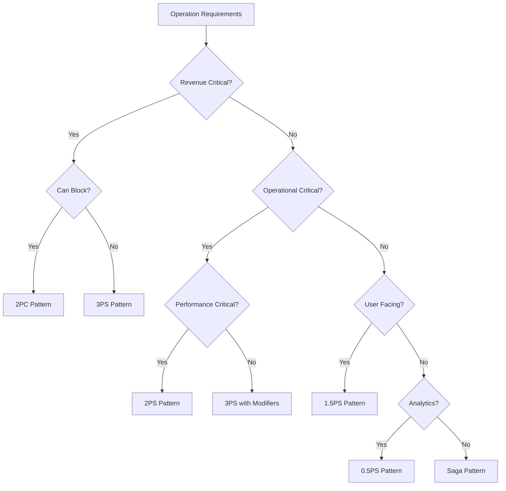

# Distributed Transaction Patterns: Mixed Pattern Architecture Guide

## Navigation
- [Main Guide](dxp-01-guide.md) - Start here
- [Theoretical Foundations](dxp-04-theoretical-foundations.md) - Why these patterns exist
- [Technical Deep Dive](dxp-02-deep-dive.md) - Implementation details
- [Sequence Diagrams](dxp-03-sequence-diagrams.md) - Visual representations
- [Pattern Modifiers](dxp-05-pattern-modifiers.md) - Optional enhancements
- [Evolution Guide](dxp-06-evolution-guide.md) - Growing with patterns
- [Essential Clarifications](dxp-07-essentials.md) - Critical details
- **You are here**: Mixed Pattern Architecture

## Table of Contents
1. [Introduction: The Heterogeneous Reality](#introduction)
2. [Why One Pattern Isn't Enough](#why-mixed)
3. [Pattern Selection Framework](#selection-framework)
4. [Implementation Strategies](#implementation)
5. [Integration Patterns](#integration)
6. [Case Studies](#case-studies)
7. [Monitoring Mixed Systems](#monitoring)
8. [Anti-Patterns and Pitfalls](#anti-patterns)
9. [Future Directions](#future)
10. [Conclusions](#conclusions)

---

## 1. Introduction: The Heterogeneous Reality {#introduction}

### The Paradigm Shift

Traditional distributed systems literature treats pattern selection as a monolithic decision. Papers compare "Saga vs 2PC" or advocate for "event sourcing everywhere." This guide challenges that orthodoxy with a simple observation: **real systems have heterogeneous requirements, and therefore need heterogeneous solutions**.

As Pat Helland noted in "Life Beyond Distributed Transactions" (2007), "different parts of the application have different needs." Yet the literature has largely ignored the implications of this insight for transaction pattern selection.

### What is Mixed Pattern Architecture?

Mixed Pattern Architecture (MPA) is the intentional use of different distributed transaction patterns for different operations within the same system, based on their specific requirements for:
- Consistency guarantees
- Performance characteristics
- Failure handling needs
- Business criticality
- Cost constraints

### Why This Guide?

While our main guide introduces the phase spectrum and individual patterns, this document addresses a critical gap: **how to successfully run multiple patterns together in production**. This isn't about migration or evolution—it's about the end state where different patterns coexist permanently.

---

## 2. Why One Pattern Isn't Enough {#why-mixed}

### The Homogeneous Pattern Fallacy

The literature often implies choosing "the" pattern for your system. Martin Kleppmann in "Designing Data-Intensive Applications" compares different consistency models but doesn't deeply explore mixing them. This creates several problems:

#### 1. Over-Engineering Non-Critical Operations

```yaml
# The "Everything is Critical" Anti-Pattern
traditional_approach:
  user_registration: "2PC"     # Overkill - eventual is fine
  password_reset: "2PC"        # Overkill - saga sufficient  
  analytics_event: "2PC"       # Massive overkill!
  payment_processing: "2PC"    # Actually appropriate
```

**Literature Gap**: Papers like "Consistency Tradeoffs in Modern Distributed Database System Design" (Abadi, 2012) discuss CAP theorem trade-offs but assume uniform choice across the system.

#### 2. Under-Engineering Critical Operations

```yaml
# The "Eventual Everything" Anti-Pattern
eventual_everywhere:
  user_preferences: "Saga"     # Fine
  recommendation_engine: "Saga" # Fine
  inventory_management: "Saga"  # Race conditions!
  payment_processing: "Saga"    # Financial disasters!
```

**Literature Insight**: Google's Spanner paper (2012) acknowledges that "different parts of Google's infrastructure had been using different types of storage systems" but focuses on providing uniformity rather than embracing heterogeneity.

#### 3. Impedance Mismatch with Business Reality

Real businesses don't think homogeneously:
- **Finance**: "Payments must never be lost or duplicated"
- **Marketing**: "Send the email when you can"
- **Analytics**: "Best effort is fine, we'll recompute"
- **Inventory**: "Prevent overselling but stay fast"

### The Theoretical Foundation for Mixing

Building on our aci-D framework (see [dxp-04-theoretical-foundations.md](dxp-04-theoretical-foundations.md)), different operations naturally require different property combinations:

```
Payment:     ACID (all properties critical)
Inventory:   aciD (atomicity, consistency, isolation critical)
Shipping:    acD  (atomicity, consistency, durability critical)
Analytics:   D    (only durability matters)
Notification: -   (best effort everything)
```

This heterogeneity in requirements **necessitates** heterogeneity in patterns.

### Economic Arguments for Mixing

Adrian Cockcroft (ex-Netflix) noted: "You don't need the same guarantees for every operation. Over-guaranteeing costs money." 

Consider the costs:
- **3PS everywhere**: 3x message overhead, complex coordination
- **2PC everywhere**: Blocking, availability issues, lock overhead
- **Saga everywhere**: Compensation complexity, race conditions

Optimal cost comes from matching pattern cost to business value.

---

## 3. Pattern Selection Framework {#selection-framework}

### The Selection Matrix

Building on Eric Brewer's CAP theorem but extending it to operation-level granularity:

```yaml
pattern_selection_matrix:
  dimensions:
    - consistency_requirement: [strong, eventual, none]
    - availability_requirement: [critical, high, normal]
    - latency_sensitivity: [<10ms, <100ms, <1s, >1s]
    - business_impact: [revenue-critical, operational, analytical]
    - data_scope: [single-entity, multi-entity, cross-domain]
    - failure_cost: [catastrophic, high, medium, low]
```

### Operation Classification Framework

#### Tier 1: Revenue-Critical Operations
**Characteristics**:
- Direct revenue impact
- Regulatory requirements
- Cannot tolerate inconsistency

**Examples**:
- Payment processing
- Trading execution
- Billing operations

**Recommended Patterns**: 2PC (if blocking acceptable) or 3PS (if not)

#### Tier 2: Operational-Critical Operations
**Characteristics**:
- Business operations depend on them
- Some inconsistency tolerable briefly
- Performance matters

**Examples**:
- Inventory management
- Order processing
- Shipment scheduling

**Recommended Patterns**: 2PS or 3PS with modifiers

#### Tier 3: User-Facing Non-Critical Operations
**Characteristics**:
- Affects user experience
- Eventual consistency acceptable
- Performance critical

**Examples**:
- Preference updates
- Recommendation calculations
- Search indexing

**Recommended Patterns**: Saga or 1.5PS

#### Tier 4: Analytical Operations
**Characteristics**:
- No immediate user impact
- Can be recomputed
- Batch processing friendly

**Examples**:
- Analytics events
- Log aggregation
- Report generation

**Recommended Patterns**: 0.5PS (fire-and-forget)

### The Decision Tree



### Literature Context: Why This Matters

The Amazon Dynamo paper (2007) states: "Different services have different requirements... a one-size-fits-all solution is not appropriate." Yet most frameworks still push uniform solutions. 

Our pattern selection framework operationalizes Dynamo's insight by providing concrete criteria for pattern selection at the operation level, not just the service level.

---

## 4. Implementation Strategies {#implementation}

### The Unified Transaction Router

Unlike traditional systems that commit to a single pattern, mixed pattern architecture requires a routing layer:

```go
type UnifiedTransactionRouter struct {
    patternSelectors map[string]PatternSelector
    coordinators     map[PatternType]Coordinator
    metrics          *MixedPatternMetrics
}

type PatternSelector interface {
    SelectPattern(op Operation) (PatternType, []Modifier)
    GetFallbackPattern() PatternType
}

// Example implementation
func (utr *UnifiedTransactionRouter) Route(ctx context.Context, tx Transaction) error {
    // Group operations by selected pattern
    patternGroups := make(map[PatternType][]*Operation)
    
    for _, op := range tx.Operations {
        selector := utr.patternSelectors[op.Service]
        pattern, modifiers := selector.SelectPattern(op)
        
        // Track pattern selection for monitoring
        utr.metrics.RecordPatternSelection(op, pattern)
        
        patternGroups[pattern] = append(patternGroups[pattern], op)
    }
    
    // Execute each group with appropriate coordinator
    return utr.executeGroups(ctx, patternGroups)
}
```

### Pattern Boundary Management

When operations span different patterns, careful boundary management is crucial:

```go
type BoundaryManager struct {
    crossPatternTimeout time.Duration
    isolationStrategy   IsolationStrategy
}

type IsolationStrategy int

const (
    // Pessimistic: Wait for all patterns to prepare
    PessimisticIsolation IsolationStrategy = iota
    
    // Optimistic: Proceed independently, validate later
    OptimisticIsolation
    
    // Hybrid: Critical patterns synchronize, others proceed
    HybridIsolation
)

func (bm *BoundaryManager) CoordinateCrossPattern(
    critical []Operation,    // 2PC/3PS operations
    standard []Operation,    // 2PS operations  
    eventual []Operation,    // Saga/0.5PS operations
) error {
    switch bm.isolationStrategy {
    case PessimisticIsolation:
        // Execute in strict order
        if err := executeWithPattern(critical, ThreePhase); err != nil {
            return err
        }
        if err := executeWithPattern(standard, TwoPhase); err != nil {
            compensate(critical)
            return err
        }
        // Eventual can't fail critically
        go executeWithPattern(eventual, HalfPhase)
        
    case OptimisticIsolation:
        // Execute all in parallel
        var wg sync.WaitGroup
        errors := make(chan error, 3)
        
        wg.Add(3)
        go executeGroup(&wg, errors, critical, ThreePhase)
        go executeGroup(&wg, errors, standard, TwoPhase)
        go executeGroup(&wg, errors, eventual, HalfPhase)
        
        wg.Wait()
        return collectErrors(errors)
        
    case HybridIsolation:
        // Synchronize critical, parallelize others
        if err := executeWithPattern(critical, ThreePhase); err != nil {
            return err
        }
        
        go executeWithPattern(standard, TwoPhase)
        go executeWithPattern(eventual, HalfPhase)
    }
    
    return nil
}
```

### Service Configuration

Each service declares its pattern preferences:

```yaml
# payment-service/config.yaml
service:
  name: payment-service
  default_pattern: "3PS"
  pattern_overrides:
    - operation: "validate_card"
      pattern: "2PS"  # Faster, sufficient
    - operation: "send_receipt"
      pattern: "0.5PS"  # Fire and forget
  modifiers:
    - type: "TimeBoundedStates"
      ttl: "5m"
    - type: "OptionalVerification"
      condition: "amount > 10000"

# analytics-service/config.yaml  
service:
  name: analytics-service
  default_pattern: "0.5PS"
  pattern_overrides:
    - operation: "revenue_reporting"
      pattern: "Saga"  # Needs reliability
```

### The Service Mesh Integration

Modern service meshes (Istio, Linkerd) can be extended to support pattern-aware routing:

```yaml
apiVersion: networking.istio.io/v1beta1
kind: VirtualService
metadata:
  name: pattern-aware-routing
spec:
  http:
  - match:
    - headers:
        x-transaction-pattern:
          exact: "3PS"
    route:
    - destination:
        host: payment-service
        subset: v2  # Version optimized for 3PS
  - match:
    - headers:
        x-transaction-pattern:
          exact: "0.5PS"
    route:
    - destination:
        host: analytics-service
        subset: batch  # Batch-optimized endpoint
```

---

## 5. Integration Patterns {#integration}

### Pattern Bridge Design

When different patterns need to interact, bridges provide adaptation:

```go
type PatternBridge interface {
    // Adapt high-consistency operation to eventual
    DowngradeConsistency(op Operation) Operation
    
    // Adapt eventual operation to consistent
    UpgradeConsistency(op Operation) Operation
    
    // Check if bridging is safe
    CanBridge(from, to PatternType) bool
}

type SafetyBridge struct {
    safetyRules []BridgingRule
}

type BridgingRule struct {
    FromPattern PatternType
    ToPattern   PatternType
    Condition   func(op Operation) bool
    Transform   func(op Operation) Operation
}

// Example: Bridging 3PS to Saga
func (sb *SafetyBridge) BridgeThreePhaseToSaga(op3PS Operation) Operation {
    return Operation{
        Type: op3PS.Type,
        Data: op3PS.Data,
        Metadata: map[string]string{
            "original_pattern": "3PS",
            "consistency_downgraded": "true",
            "timestamp": time.Now().String(),
        },
        CompensationStrategy: EnhancedCompensation, // Stronger compensation
    }
}
```

### Cross-Pattern Transactions

Real-world example: An e-commerce order that spans patterns:

```go
type MixedPatternOrder struct {
    OrderID string
    
    // 3PS - Payment must be perfect
    PaymentOps []Operation // Charge, fraud check
    
    // 2PS - Inventory needs consistency  
    InventoryOps []Operation // Reserve, decrement
    
    // Saga - Shipping is compensatable
    ShippingOps []Operation // Schedule, route
    
    // 0.5PS - Analytics is best effort
    AnalyticsOps []Operation // Events, metrics
}

func ProcessMixedOrder(order MixedPatternOrder) error {
    ctx := context.Background()
    
    // Phase 1: Critical operations (3PS)
    payment3PS := New3PSCoordinator()
    if err := payment3PS.Execute(ctx, order.PaymentOps); err != nil {
        return fmt.Errorf("payment failed: %w", err)
    }
    
    // Phase 2: Operational (2PS) - only if payment succeeded
    inventory2PS := New2PSCoordinator()
    if err := inventory2PS.Execute(ctx, order.InventoryOps); err != nil {
        // Must compensate payment!
        payment3PS.Compensate(ctx, order.PaymentOps)
        return fmt.Errorf("inventory failed: %w", err)
    }
    
    // Phase 3: Standard operations (Saga) - failures are handled
    shippingSaga := NewSagaCoordinator()
    if err := shippingSaga.Execute(ctx, order.ShippingOps); err != nil {
        // Log but don't fail the order
        log.Warnf("shipping scheduling failed: %v", err)
    }
    
    // Phase 4: Analytics (0.5PS) - fire and forget
    go func() {
        analytics05PS := NewHalfPhaseCoordinator()
        analytics05PS.Execute(context.Background(), order.AnalyticsOps)
    }()
    
    return nil
}
```

### Dependency Management

Critical insight: Pattern dependencies should flow from strong to weak consistency:

```
3PS/2PC → 2PS → Saga → 1.5PS → 0.5PS
Strong                            Weak
```

Never have weak consistency operations that strong consistency operations depend on.

---

## 6. Case Studies {#case-studies}

### Case Study 1: Netflix - Streaming Service Architecture

**Context**: Netflix processes millions of concurrent streams with different consistency needs.

**Pattern Distribution**:
```yaml
netflix_patterns:
  billing_system:
    pattern: "3PS"
    reason: "Financial accuracy critical"
    volume: "10K transactions/minute"
    
  content_delivery:
    pattern: "0.5PS"  
    reason: "Buffering handles failures"
    volume: "10M events/minute"
    
  recommendation_engine:
    pattern: "Saga"
    reason: "Eventual consistency acceptable"
    volume: "100K updates/minute"
    
  viewing_history:
    pattern: "1.5PS"
    reason: "Mix of critical (position) and eventual (thumbnails)"
    volume: "1M updates/minute"
```

**Key Learning**: The 1000:1 ratio between content events and billing shows why uniform patterns fail—you can't run analytics patterns at billing consistency without destroying performance.

### Case Study 2: Uber - Real-Time Ride Coordination

**Challenge**: Coordinate drivers, riders, and payments with different consistency needs.

**Pattern Architecture**:
```yaml
uber_patterns:
  payment_processing:
    pattern: "2PC"  # Within region
    cross_region_pattern: "3PS"
    
  driver_location:
    pattern: "0.5PS"
    note: "Updates every 4 seconds, loss tolerable"
    
  ride_matching:
    pattern: "2PS"
    note: "Must prevent double-booking"
    
  surge_pricing:
    pattern: "Saga"
    note: "Can recalculate if needed"
```

**Innovation**: Uber uses different patterns for the same data at different times:
- Driver location during search: 0.5PS (speed critical)
- Driver location during ride: 1.5PS (accuracy matters)
- Driver location for payment: 3PS (distance = money)

### Case Study 3: Amazon - Retail and AWS

**Retail Side**:
```yaml
amazon_retail:
  buy_box_calculation:
    pattern: "0.5PS"
    note: "Recalculated frequently"
    
  add_to_cart:
    pattern: "Saga"
    note: "Carts are ephemeral"
    
  checkout:
    pattern: "2PS"
    note: "Validate price and inventory"
    
  payment:
    pattern: "3PS"
    note: "No double charges"
    
  one_click_buy:
    pattern: "3PS"
    note: "All-or-nothing critical"
```

**AWS Side**:
```yaml
aws_patterns:
  ec2_provisioning:
    pattern: "3PS"
    note: "Resource allocation critical"
    
  cloudwatch_metrics:
    pattern: "0.5PS"
    note: "Some loss acceptable"
    
  billing_metering:
    pattern: "2PS"
    note: "Accuracy with performance"
```

**Key Insight**: Even within Amazon, retail and AWS use different patterns for similar operations (billing) based on different requirements.

### Case Study 4: Financial Trading Platform

**Extreme Requirements**: Mixing microsecond trading with daily settlements.

```yaml
trading_platform:
  order_execution:
    pattern: "2PC"
    latency_budget: "10μs"
    note: "Hardware-accelerated 2PC"
    
  market_data_distribution:
    pattern: "0.5PS"
    latency_budget: "1μs"
    note: "UDP multicast, no guarantees"
    
  position_calculation:
    pattern: "2PS"
    latency_budget: "1ms"
    note: "Consistent view critical"
    
  settlement:
    pattern: "3PS"
    latency_budget: "1s"
    note: "Accuracy over speed"
    
  compliance_reporting:
    pattern: "Saga"
    latency_budget: "1 hour"
    note: "Batch processing acceptable"
```

**Learning**: Latency budgets vary by 6 orders of magnitude (1μs to 1 hour) within the same system—impossible with uniform patterns.

---

## 7. Monitoring Mixed Systems {#monitoring}

### The Challenge of Mixed Metrics

Traditional monitoring assumes uniform patterns. Mixed systems need pattern-aware monitoring:

```go
type MixedPatternMetrics struct {
    // Pattern-specific metrics
    patternMetrics map[PatternType]PatternSpecificMetrics
    
    // Cross-pattern metrics
    boundaryLatency    prometheus.Histogram
    patternMismatches  prometheus.Counter
    consistencyBridges prometheus.Counter
}

type PatternSpecificMetrics struct {
    // Common metrics
    Throughput prometheus.Counter
    Latency    prometheus.Histogram
    Errors     prometheus.Counter
    
    // Pattern-specific
    CompensationRate  prometheus.Gauge     // Saga only
    PrepareFailures   prometheus.Counter   // 2PS only
    ValidationRejects prometheus.Counter   // 3PS only
    DeliveryRate      prometheus.Gauge     // 0.5PS only
}
```

### Unified Dashboard Design

```yaml
mixed_pattern_dashboard:
  summary_row:
    - title: "Transaction Volume by Pattern"
      visualization: "stacked_bar"
      grouping: "pattern_type"
      
    - title: "Success Rate by Pattern"  
      visualization: "line"
      grouping: "pattern_type"
      
    - title: "Pattern Selection Distribution"
      visualization: "pie"
      metric: "pattern_selection_count"
      
  pattern_specific_rows:
    - pattern: "3PS"
      metrics: ["validation_success_rate", "phase_progression", "reservation_conflicts"]
      
    - pattern: "2PS"
      metrics: ["prepare_duration", "phase_completion_rate", "timeout_rate"]
      
    - pattern: "Saga"
      metrics: ["compensation_rate", "compensation_chain_depth", "saga_duration"]
      
    - pattern: "0.5PS"
      metrics: ["fire_rate", "eventual_delivery_rate", "message_age_p99"]
      
  boundary_metrics:
    - title: "Cross-Pattern Transaction Duration"
      breakdown_by: ["source_pattern", "target_pattern"]
      
    - title: "Pattern Bridge Utilization"
      metric: "bridge_invocations"
      
    - title: "Consistency Downgrades"
      alert_threshold: 100  # per minute
```

### Pattern Health Scoring

Each pattern needs different health indicators:

```go
func CalculatePatternHealth(pattern PatternType, metrics Metrics) float64 {
    switch pattern {
    case ThreePhase:
        // 3PS health based on validation success
        validationRate := metrics.ValidationSuccess / metrics.ValidationAttempts
        conflictRate := metrics.ReservationConflicts / metrics.Reservations
        return 0.7*validationRate + 0.3*(1-conflictRate)
        
    case TwoPhase:
        // 2PS health based on prepare success
        prepareRate := metrics.PrepareSuccess / metrics.PrepareAttempts
        timeoutRate := metrics.Timeouts / metrics.Attempts
        return 0.6*prepareRate + 0.4*(1-timeoutRate)
        
    case Saga:
        // Saga health based on compensation rate
        compensationRate := metrics.Compensations / metrics.Executions
        return 1 - compensationRate // Lower is better
        
    case HalfPhase:
        // 0.5PS health based on delivery (if tracked)
        if metrics.DeliveryTracked {
            return metrics.EventualDelivery / metrics.FireAttempts
        }
        return 1.0 // Assume healthy if not tracked
    }
}
```

---

## 8. Anti-Patterns and Pitfalls {#anti-patterns}

### Anti-Pattern 1: Pattern Shopping

**Description**: Changing patterns frequently based on temporary conditions.

```go
// ANTI-PATTERN: Don't do this!
func SelectPattern(load float64) PatternType {
    if load > 0.8 {
        return HalfPhase  // "Let's just fire and forget under load"
    } else if dayOfWeek == "Friday" {
        return ThreePhase // "More careful on Fridays"
    } else if userRegion == "EU" {
        return TwoPC      // "GDPR means we need 2PC"
    }
    // Pattern chaos!
}
```

**Why it's bad**: Inconsistent behavior, impossible to debug, violates user expectations.

**Better approach**: Stable pattern selection based on operation type, not runtime conditions.

### Anti-Pattern 2: Consistency Inversion

**Description**: Having eventual operations that consistent operations depend on.

```go
// ANTI-PATTERN: Inverted dependencies
type OrderProcessing struct {
    // 0.5PS operation
    CheckInventory() bool  // Fire-and-forget inventory check
    
    // 3PS operation  
    ProcessPayment() error // Depends on inventory check!
}
```

**Why it's bad**: Strong consistency operations can't depend on weak consistency inputs.

**Better approach**: Flow from strong to weak consistency.

### Anti-Pattern 3: Pattern Mismatch Hiding

**Description**: Pretending operations have different guarantees than they do.

```go
// ANTI-PATTERN: Lying about guarantees
func ProcessCriticalOperation(op Operation) error {
    // Actually using 0.5PS internally
    go processEventually(op)
    
    // But returning like it's synchronous!
    return nil // Lying - we don't know if it worked
}
```

**Why it's bad**: Violates API contracts, surprises users, corrupts data.

### Anti-Pattern 4: Compensation Cascade

**Description**: Mixing patterns that create complex compensation chains.

```yaml
# ANTI-PATTERN: Compensation nightmare
transaction_flow:
  - service: A
    pattern: "Saga"
    compensates_to: [B, C]
  - service: B  
    pattern: "2PS"
    compensates_to: [C, D]
  - service: C
    pattern: "3PS"
    compensates_to: [D, E]
  - service: D
    pattern: "Saga"
    compensates_to: [E]
  - service: E
    pattern: "0.5PS"  # Can't compensate!
```

**Why it's bad**: Compensation fails at E, cascades back through D, C, B, A.

### Anti-Pattern 5: Silent Pattern Degradation

**Description**: Automatically downgrading patterns without notification.

```go
// ANTI-PATTERN: Silent degradation
func ExecuteWithFallback(op Operation) error {
    err := execute3PS(op)
    if err != nil {
        // Silently downgrade to Saga
        err = executeSaga(op)
        if err != nil {
            // Further downgrade to 0.5PS
            execute05PS(op)
        }
    }
    return nil // Always returns success!
}
```

**Why it's bad**: Users expect 3PS guarantees, get 0.5PS behavior.

---

## 9. Future Directions {#future}

### Emerging Patterns in Mixed Architectures

#### 1. ML-Driven Pattern Selection

Research direction: Using machine learning to automatically select patterns:

```python
# Future: ML-based pattern selection
def predict_optimal_pattern(operation_features):
    features = extract_features(operation_features)
    # Features: operation_type, data_size, time_of_day, 
    #           historical_failure_rate, business_value
    
    model = load_model("pattern_selector_v2")
    pattern, confidence = model.predict(features)
    
    if confidence > 0.9:
        return pattern
    else:
        return fallback_pattern
```

#### 2. Dynamic Pattern Adaptation

Literature gap: Current systems use static pattern selection. Future systems might adapt:

```go
// Future: Adaptive pattern selection
type AdaptiveRouter struct {
    basePattern     PatternType
    currentPattern  PatternType
    performanceGoal PerformanceTarget
    adaptInterval   time.Duration
}

func (ar *AdaptiveRouter) Adapt() {
    metrics := ar.collectMetrics()
    
    if metrics.FailureRate > ar.performanceGoal.MaxFailureRate {
        // Upgrade to stronger pattern
        ar.currentPattern = ar.strongerPattern()
    } else if metrics.Latency > ar.performanceGoal.MaxLatency {
        // Downgrade to faster pattern
        ar.currentPattern = ar.fasterPattern()
    }
}
```

#### 3. Cross-Cloud Pattern Bridging

As multi-cloud becomes standard, pattern bridging across clouds:

```yaml
multi_cloud_patterns:
  aws_region:
    internal_pattern: "3PS"
    external_interface: "Saga"  # For cross-cloud
    
  gcp_region:
    internal_pattern: "2PS"
    external_interface: "Saga"
    
  azure_region:
    internal_pattern: "2PC"  # Legacy system
    external_interface: "Saga"
    
  bridge_strategy: "eventual_consistency_with_reconciliation"
```

### Research Opportunities

1. **Formal Verification of Mixed Systems**: Proving safety properties across pattern boundaries
2. **Automated Pattern Migration**: Systems that evolve their pattern mix automatically
3. **Pattern-Aware Databases**: Storage systems optimized for specific patterns
4. **Standardized Pattern Protocols**: Industry standards for pattern interoperability

---

## 10. Conclusions {#conclusions}

### The Mixed Pattern Insight

The insight of a compositional architecture based on combinatorial patterns represents a fundamental shift in how we think about distributed systems:

**From**: "Choose the right pattern for your system"  
**To**: "Choose the right pattern for each operation"

This shift acknowledges that:
1. **Real systems are heterogeneous** - Different parts have different needs
2. **One size fits none** - Uniform patterns either over-engineer or under-engineer
3. **Business alignment matters** - Technical patterns should match business criticality
4. **Cost optimization requires mixing** - Running everything at highest consistency wastes resources

### Key Principles for Success

1. **Make patterns explicit** - Document which operations use which patterns
2. **Flow strong to weak** - Never depend on weaker consistency
3. **Monitor pattern-specifically** - Different patterns need different metrics
4. **Avoid pattern shopping** - Stable selection prevents chaos
5. **Embrace the mix** - It's not a compromise, it's optimal

### The Competitive Advantage

Organizations that successfully implement mixed pattern architectures gain:
- **Cost efficiency**: Right-sized consistency for each operation
- **Performance**: Fast patterns where speed matters
- **Reliability**: Strong patterns where correctness matters
- **Flexibility**: Easy to evolve individual operations

### Final Thought

As Leslie Lamport noted in "Time, Clocks, and the Ordering of Events" (1978): "A distributed system is one in which the failure of a computer you didn't even know existed can render your own computer unusable."

Mixed Pattern Architecture acknowledges this reality by letting each operation choose its own trade-offs. Instead of forcing uniform behavior across heterogeneous systems, we embrace the heterogeneity and give each operation the pattern it needs.

The future of distributed systems isn't about finding the perfect pattern—it's about perfectly mixing patterns to match reality. This guide provides the framework for that mixing, turning what was once architectural compromise into architectural strategy.

By acknowledging that different operations have different needs and providing patterns to match, we can build systems that are simultaneously more efficient, more reliable, and more maintainable than any uniform approach could achieve.

This is our entrance into a world of compositional patterns.
