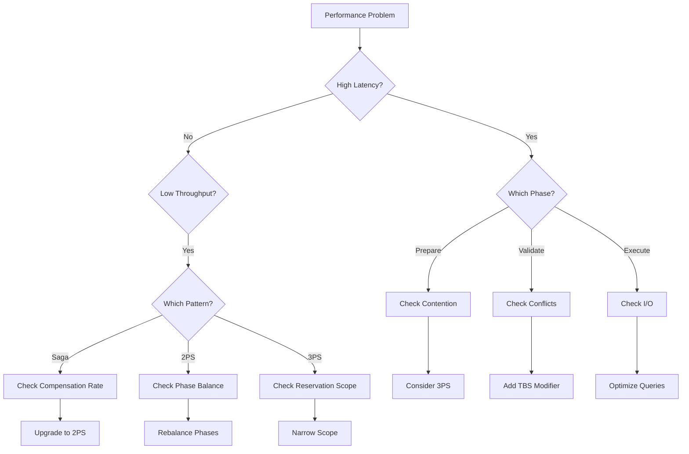

# Distributed Transaction Patterns: A Cognitive Guide

## Navigation
- [Main Guide](dxp-01-guide.md) - Start here
- [Theoretical Foundations](dxp-04-theoretical-foundations.md) - Why these patterns exist
- [Technical Deep Dive](dxp-02-deep-dive.md) - Implementation details
- [Sequence Diagrams](dxp-03-sequence-diagrams.md) - Visual representations
- [Pattern Modifiers](dxp-05-pattern-modifiers.md) - Optional enhancements
- [Evolution Guide](dxp-06-evolution-guide.md) - Growing with patterns
- [Essential Clarifications](dxp-07-essentials.md) - Critical details
- [Mixed Pattern Architecture](dxp-08-pattern-mixing-guide.md) - Using multiple patterns
- **You are here**: Cognitive Guide

## Table of Contents
1. [Introduction: The Invisible Problem](#introduction)
2. [The Language Problem in Distributed Systems](#language-problem)
3. [Pattern Recognition and Mental Models](#mental-models)
4. [From Symptoms to Diagnoses](#symptoms-to-diagnoses)
5. [Team Communication Frameworks](#communication)
6. [Learning Progression](#learning)
7. [Debugging with Pattern Awareness](#debugging)
8. [Architectural Decision Making](#decision-making)
9. [Knowledge Transfer and Documentation](#knowledge-transfer)
10. [Conclusions](#conclusions)

---

## 1. Introduction: The Invisible Problem {#introduction}

### The Cognitive Challenge

In their seminal work "The Cognitive Dimensions of Notations" (1996), Thomas Green and Marian Petre identified that the way we represent problems fundamentally affects our ability to solve them. Nowhere is this more true than in distributed systems, where:

- **Failures are non-local**: Effects appear far from causes
- **Time is relative**: Events lack a global ordering
- **State is distributed**: No single source of truth
- **Behaviors emerge**: System properties arise from interactions

### What This Guide Provides

This guide addresses the cognitive aspects of understanding and communicating about distributed transaction patterns. It transforms the invisible into the visible by providing:

1. **Vocabulary**: Names for patterns teams are already building
2. **Mental Models**: Frameworks for reasoning about behavior
3. **Diagnostic Tools**: Systematic approaches to problem identification
4. **Communication Templates**: Structured ways to discuss patterns

### The Power of Naming

As noted in "The Pragmatic Programmer" (Hunt & Thomas, 1999): "The limits of language are the limits of one's world." By naming patterns like 2PS and 3PS, we expand what teams can perceive and discuss.

---

## 2. The Language Problem in Distributed Systems {#language-problem}

### Before: The Vocabulary Vacuum

Without pattern vocabulary, teams resort to vague, symptom-based descriptions:

```yaml
before_vocabulary:
  problem_reports:
    - "The system is slow sometimes"
    - "We're losing orders occasionally"
    - "Things work in dev but fail in production"
    - "It's probably a race condition"
    - "The payment service is flaky"
    
  attempted_solutions:
    - "Add more retries"
    - "Increase timeouts"
    - "Add more logging"
    - "Restart the service"
    - "Add a delay (sleep)"
```

### After: Precise Pattern Language

With the Phase Spectrum vocabulary:

```yaml
after_vocabulary:
  problem_diagnoses:
    - "15% compensation rate indicates Saga race conditions"
    - "2PS prepare phase timeouts suggest resource contention"
    - "3PS validation failures show concurrent modifications"
    - "0.5PS delivery tracking shows 98% eventual success"
    
  targeted_solutions:
    - "Migrate from Saga to 2PS to prevent race conditions"
    - "Add TBS modifier to prevent resource leaks"
    - "Implement OV for long-running 2PS transactions"
    - "Use GA modifier to reduce cross-region latency"
```

### Literature Context: Why Vocabulary Matters

Fred Brooks in "The Mythical Man-Month" (1975) noted: "The programmer, like the poet, works only slightly removed from pure thought-stuff. He builds his castles in the air, from air, creating by exertion of the imagination."

Our pattern vocabulary makes these "castles in the air" concrete and discussable. Research in cognitive science shows that having precise vocabulary:

1. **Reduces cognitive load** (Sweller, 1988)
2. **Enables pattern matching** (Chi et al., 1981)
3. **Facilitates team communication** (Curtis et al., 1988)
4. **Accelerates learning** (Soloway & Ehrlich, 1984)

### The Sapir-Whorf Hypothesis in Software

The Sapir-Whorf hypothesis suggests that language shapes thought. In distributed systems, this manifests as:

**Without Pattern Language**:
- "We need to make this more reliable" → Vague improvements
- "Handle failures better" → Ad-hoc retry logic
- "Prevent data corruption" → Scattered validation

**With Pattern Language**:
- "We need 2PS's early failure detection" → Specific implementation
- "3PS validation phase prevents this race" → Clear solution
- "TBS modifier prevents resource exhaustion" → Targeted enhancement

---

## 3. Pattern Recognition and Mental Models {#mental-models}

### The Expert's Eye

Research on chess masters (de Groot, 1965) showed they don't analyze more moves—they recognize patterns instantly. Similarly, experienced engineers with pattern vocabulary can quickly identify:

```go
// Novice sees: "Complex retry logic with state management"
func ProcessWithRetry(ctx context.Context, op Operation) error {
    state := "pending"
    attempts := 0
    maxAttempts := 3
    
    for attempts < maxAttempts {
        err := tryOperation(op)
        if err == nil {
            state = "completed"
            return nil
        }
        
        if !isRetriable(err) {
            state = "failed"
            return err
        }
        
        attempts++
        time.Sleep(backoff(attempts))
    }
    
    return compensate(op)
}

// Expert recognizes: "Basic Saga with compensation"
// - Retry logic → Saga resilience
// - Compensate call → Saga pattern
// - No prepare phase → Not 2PS
// - No validation → Not 3PS
```

### Mental Models as Compression

George Miller's "The Magical Number Seven" (1956) identified limits to working memory. Pattern names act as compression:

**Without Patterns** (7+ concepts):
- Distributed operation
- Failure handling
- Compensation logic
- Retry mechanism
- Timeout management
- State tracking
- Consistency guarantees

**With Patterns** (1 concept):
- "Saga pattern with standard modifiers"

### Building Accurate Mental Models

#### The Phase Spectrum Mental Model

```
Visualization: The Consistency Slider

0.5PS ────────────────────────────── 3PS
🔥                                    🏦
Fast & Loose                    Safe & Sound

Key Insights:
- Left = Speed, Right = Safety
- More phases = More coordination
- Each step right costs performance
- Each step left risks consistency
```

#### The aci-D Mental Model

```
Traditional ACID: All or Nothing
  A C I D  ✓ ✓ ✓ ✓  or  ✗ ✗ ✗ ✗

aci-D Framework: Selective Properties
  a c i D  Choose what you need:
  ✓ ✓ ✗ ✓  (3PS: Most properties)
  ✓ ✗ ✗ ✗  (0.5PS: Speed only)
  ✓ ✓ ✗ ✓  (2PS: Balanced)
```

### Literature on Mental Models

Don Norman in "The Design of Everyday Things" (1988) emphasized that good mental models:
1. **Are predictive**: Users can anticipate behavior
2. **Are simple**: Capture essence without overwhelming detail
3. **Are memorable**: Stick in long-term memory
4. **Map to reality**: Accurately represent the system

Our phase spectrum provides all four qualities.

---

## 4. From Symptoms to Diagnoses {#symptoms-to-diagnoses}

### The Diagnostic Framework

Medical diagnosis moved from symptoms ("patient has fever") to conditions ("bacterial infection"). Similarly, we move from symptoms to pattern-specific diagnoses:

#### Symptom: "System is Slow"

**Pre-Pattern Analysis**:
```
- Check CPU usage
- Look at network latency  
- Profile database queries
- Add more servers
```

**Pattern-Aware Diagnosis**:
```go
func DiagnoseSlowness(metrics SystemMetrics) Diagnosis {
    if metrics.PreparePhaseLatency > metrics.ExecutePhaseLatency {
        return Diagnosis{
            Pattern: "2PS",
            Issue: "Prepare phase blocking",
            Evidence: "Prepare takes 200ms, Execute takes 50ms",
            Recommendation: "Consider 3PS for parallel preparation",
        }
    }
    
    if metrics.CompensationRate > 0.1 {
        return Diagnosis{
            Pattern: "Saga",
            Issue: "High compensation overhead",
            Evidence: "10% of transactions require compensation",
            Recommendation: "Consider 2PS to fail fast",
        }
    }
    
    if metrics.CrossRegionCalls > metrics.LocalCalls {
        return Diagnosis{
            Pattern: "Any",
            Issue: "Geographic distribution",
            Evidence: "70% calls cross regions",
            Recommendation: "Add GA modifier for regional affinity",
        }
    }
}
```

### Pattern-Specific Smells

Drawing from Martin Fowler's "code smells" concept, we identify "pattern smells":

#### Saga Smells

```yaml
saga_smells:
  compensation_cascade:
    symptom: "Compensations triggering more compensations"
    diagnosis: "Race condition in concurrent sagas"
    solution: "Upgrade to 2PS for atomic prepare"
    
  compensation_failure_loop:
    symptom: "Compensation fails, retries forever"
    diagnosis: "Non-idempotent compensation"
    solution: "Implement idempotency keys"
    
  partial_state_visibility:
    symptom: "Users see incomplete orders"
    diagnosis: "No isolation in saga"
    solution: "Use 1.5PS to hide non-critical updates"
```

#### 2PS Smells

```yaml
2ps_smells:
  prepare_timeout_spike:
    symptom: "Sudden increase in prepare timeouts"
    diagnosis: "Resource contention or deadlock"
    solution: "Analyze lock order, consider 3PS"
    
  asymmetric_phase_duration:
    symptom: "Prepare: 500ms, Execute: 10ms"
    diagnosis: "Over-validation in prepare"
    solution: "Move validations to execute phase"
    
  sequential_prepares:
    symptom: "Services waiting for each other"
    diagnosis: "Improper parallelization"
    solution: "Ensure prepare calls are concurrent"
```

#### 3PS Smells

```yaml
3ps_smells:
  validation_thrashing:
    symptom: "Same transaction validates multiple times"
    diagnosis: "High contention on resources"
    solution: "Add backoff or use TBS for faster cleanup"
    
  reservation_leaks:
    symptom: "Resources permanently reserved"
    diagnosis: "Missing expiration logic"
    solution: "Add TBS modifier with TTL"
    
  false_conflicts:
    symptom: "Validation fails for unrelated resources"
    diagnosis: "Over-broad reservation scope"
    solution: "Narrow reservation granularity"
```

### The Diagnostic Decision Tree



---

## 5. Team Communication Frameworks {#communication}

### Architecture Decision Records (ADRs) with Patterns

Michael Nygard's ADR format, enhanced for patterns:

```markdown
# ADR-042: Migrate Payment Processing from Saga to 3PS

## Status
Proposed

## Context
- Current: Saga pattern with compensation
- Problem: 12% compensation rate causing customer complaints
- Evidence: 847 failed payments required manual intervention in Q3

## Decision
Migrate payment processing to 3PS pattern with TBS modifier

## Consequences
### Positive
- Race conditions eliminated by validation phase
- No more compensation failures
- Automatic cleanup via TBS

### Negative  
- 20% increase in message complexity
- Requires state store upgrade
- Team needs 3PS training

### Metrics for Success
- Compensation rate < 0.1%
- Zero manual interventions
- P99 latency < 200ms
```

### Pattern Migration Proposals

Structured template for proposing pattern changes:

```yaml
migration_proposal:
  title: "Inventory Service: Saga → 2PS Migration"
  
  current_state:
    pattern: "Saga"
    metrics:
      compensation_rate: "8%"
      race_conditions_per_day: 15
      manual_fixes_per_week: 5
      
  proposed_state:
    pattern: "2PS"
    modifiers: ["TBS"]
    expected_metrics:
      compensation_rate: "<1%"
      race_conditions_per_day: 0
      manual_fixes_per_week: 0
      
  migration_plan:
    phase1: "Implement 2PS alongside Saga"
    phase2: "Route 10% traffic to 2PS"
    phase3: "Monitor and compare metrics"
    phase4: "Gradual rollout to 100%"
    
  rollback_plan:
    trigger: "Error rate > 2%"
    action: "Route all traffic back to Saga"
    
  team_readiness:
    training_required: "2PS workshop (4 hours)"
    documentation_updated: true
    runbooks_prepared: true
```

### Incident Communication

Pattern-aware incident reports:

```markdown
## Incident Report: Order Processing Failure

**Pattern Context**: 2PS with 5-minute TBS

**Timeline**:
- 14:32 - Prepare phase latency spike (50ms → 500ms)
- 14:35 - TBS timeouts begin (resources held > 5min)
- 14:37 - Cascading failures as resource pool exhausted

**Root Cause**: Database index corruption caused prepare phase to slow down, exceeding TBS timeout

**Pattern-Specific Fix**: 
1. Immediate: Increase TBS timeout to 10min
2. Long-term: Add index monitoring to prevent degradation

**Lessons Learned**:
- TBS timeout must account for infrastructure degradation
- Consider OV modifier for expensive prepare operations
```

### Cross-Team Pattern Vocabulary

Establishing shared vocabulary across teams:

```yaml
pattern_glossary:
  terms:
    phase:
      definition: "Synchronization point in distributed transaction"
      example: "2PS has prepare and execute phases"
      
    compensation:
      definition: "Reverse operation to undo effects"
      example: "Refund payment if shipping fails"
      
    validation:
      definition: "Read-only check in 3PS pattern"
      example: "Verify inventory still available"
      
    reservation:
      definition: "Temporary claim on resources"
      example: "Hold inventory for 10 minutes"
      
  pattern_nicknames:
    0.5PS: "Fire and Forget"
    Saga: "Compensator"
    2PS: "Prepare-Execute"
    3PS: "Reserve-Validate-Execute"
    
  modifier_shortcuts:
    OV: "Double-check"
    TBS: "Auto-expire"
    GA: "Keep it local"
    SC: "Pick your consistency"
```

---

## 6. Learning Progression {#learning}

### The Dreyfus Model Applied to Patterns

The Dreyfus model of skill acquisition (1980) identifies five stages. Here's how they apply to distributed transaction patterns:

#### Stage 1: Novice (Day 1-7)
**Characteristics**:
- Follows rules without understanding
- Needs explicit instructions
- Can't prioritize information

**Learning Goals**:
```yaml
week_1_objectives:
  understand:
    - "Transactions can't span services"
    - "Each pattern makes trade-offs"
    - "More phases = more safety"
  
  recognize:
    - Basic saga compensation
    - 2PC blocking behavior
    - Fire-and-forget semantics
    
  implement:
    - Hello-world saga
    - Simple compensation logic
```

#### Stage 2: Advanced Beginner (Week 2-4)
**Characteristics**:
- Recognizes patterns in context
- Still struggles with novel situations
- Beginning to see trade-offs

**Learning Goals**:
```yaml
month_1_objectives:
  understand:
    - Race conditions in saga
    - Early failure detection in 2PS
    - Validation phase purpose in 3PS
    
  recognize:
    - Compensation cascades
    - Prepare phase bottlenecks
    - Resource leaks
    
  implement:
    - 2PS coordinator
    - Idempotent operations
    - Basic monitoring
```

#### Stage 3: Competent (Month 2-3)
**Characteristics**:
- Makes conscious planning decisions
- Can troubleshoot common issues
- Understands pattern selection

**Learning Goals**:
```yaml
quarter_1_objectives:
  understand:
    - aci-D trade-offs
    - Pattern evolution paths
    - Modifier composition
    
  diagnose:
    - High compensation rates
    - Phase imbalances
    - Cross-pattern issues
    
  design:
    - Pattern selection matrix
    - Migration strategies
    - Monitoring dashboards
```

#### Stage 4: Proficient (Month 4-12)
**Characteristics**:
- Intuitive pattern recognition
- Holistic understanding
- Can mentor others

**Skills Demonstrated**:
- Quickly diagnoses issues from symptoms
- Designs mixed-pattern architectures
- Optimizes pattern configurations
- Leads pattern migrations

#### Stage 5: Expert (Year 2+)
**Characteristics**:
- Intuitive, fluid understanding
- Innovates new approaches
- Transcends rules

**Expert Behaviors**:
- Invents situation-specific modifiers
- Optimizes across pattern boundaries
- Contributes to pattern framework evolution

### Learning Resources by Stage

```yaml
learning_path:
  novice:
    - Read: Main guide overview
    - Watch: Pattern basics video
    - Do: Saga hello-world
    
  beginner:
    - Read: Sequence diagrams
    - Watch: Race condition demos
    - Do: Implement 2PS
    
  competent:
    - Read: Technical deep dive
    - Watch: Production case studies
    - Do: Design mixed system
    
  proficient:
    - Read: All documentation
    - Watch: Conference talks
    - Do: Lead migration project
    
  expert:
    - Read: Academic papers
    - Create: New modifiers
    - Do: Contribute to framework
```

### Common Learning Obstacles

Based on cognitive load theory (Sweller, 1988):

1. **Phase Confusion**: Mixing prepare/reserve/validate
   - **Solution**: Clear comparison table
   - **Mnemonic**: "Prepare locks, Reserve claims, Validate checks"

2. **Pattern Overlap**: When patterns seem similar
   - **Solution**: Focus on key differentiators
   - **Tool**: Decision tree flowchart

3. **Modifier Composition**: Understanding interactions
   - **Solution**: Start with single modifiers
   - **Practice**: Add modifiers incrementally

---

## 7. Debugging with Pattern Awareness {#debugging}

### Pattern-Aware Debugging Process

Traditional debugging focuses on symptoms. Pattern-aware debugging identifies systemic issues:

#### Traditional Debugging Flow
```
1. User reports problem
2. Check logs for errors
3. Try to reproduce
4. Add more logging
5. Make educated guess
6. Deploy fix
7. Hope it works
```

#### Pattern-Aware Debugging Flow
```
1. User reports problem
2. Identify pattern from architecture
3. Check pattern-specific metrics
4. Match symptoms to pattern smells
5. Apply pattern-specific diagnosis
6. Implement pattern-appropriate fix
7. Verify with pattern health metrics
```

### Debugging Tools by Pattern

#### Saga Pattern Debugging

```go
type SagaDebugger struct {
    CompensationTracker map[string]CompensationChain
    RaceDetector        *ConcurrencyAnalyzer
}

func (sd *SagaDebugger) AnalyzeFailure(txID string) DebugReport {
    report := DebugReport{TransactionID: txID}
    
    // Check compensation chain
    chain := sd.CompensationTracker[txID]
    report.CompensationDepth = len(chain.Steps)
    report.CompensationDuration = chain.TotalDuration()
    
    // Detect race conditions
    races := sd.RaceDetector.FindRaces(txID)
    if len(races) > 0 {
        report.Diagnosis = "Race condition detected"
        report.Recommendation = "Consider 2PS upgrade"
        report.Evidence = races
    }
    
    return report
}
```

#### 2PS Pattern Debugging

```go
type TwoPSDebugger struct {
    PhaseTracker *PhaseMetrics
    DeadlockDetector *DeadlockAnalyzer
}

func (td *TwoPSDebugger) AnalyzeSlowness(txID string) DebugReport {
    prepare := td.PhaseTracker.GetPhaseDuration(txID, "prepare")
    execute := td.PhaseTracker.GetPhaseDuration(txID, "execute")
    
    if prepare > 3 * execute {
        return DebugReport{
            Diagnosis: "Prepare phase bottleneck",
            Evidence: fmt.Sprintf("Prepare: %v, Execute: %v", prepare, execute),
            Recommendation: "Consider 3PS for parallel preparation",
        }
    }
    
    if deadlock := td.DeadlockDetector.Check(txID); deadlock != nil {
        return DebugReport{
            Diagnosis: "Deadlock detected",
            Evidence: deadlock.CycleDescription(),
            Recommendation: "Review lock ordering",
        }
    }
}
```

### Visual Debugging with Pattern Context

The importance of visualization in debugging (Tufte, 1983):

```
Traditional Log View:
2024-01-01 10:00:01 ERROR Payment failed
2024-01-01 10:00:02 INFO Retry attempt 1
2024-01-01 10:00:03 ERROR Payment failed
2024-01-01 10:00:04 INFO Starting compensation

Pattern-Aware Timeline:
10:00:00 [Saga Start      ] ━━━━━━━━━━━┓
10:00:01 [Payment FAIL    ] ━━━━━X     ┃
10:00:02 [Inventory OK    ] ━━━━━━━━━┓ ┃
10:00:03 [Shipping OK     ] ━━━━━━━━━┫ ┃
10:00:04 [Compensate Ship ] ←────────┛ ┃
10:00:05 [Compensate Inv  ] ←──────────┛
10:00:06 [Saga Complete   ] (with compensation)

Diagnosis: Classic saga race - inventory and shipping 
proceeded despite payment failure
```

---

## 8. Architectural Decision Making {#decision-making}

### Cognitive Biases in Pattern Selection

Daniel Kahneman's "Thinking, Fast and Slow" (2011) identifies biases that affect architectural decisions:

#### Availability Heuristic
**Bias**: Overweighting recent experiences
```yaml
example:
  situation: "We had a saga race condition last week"
  biased_decision: "Never use saga again!"
  rational_decision: "Use saga for low-contention operations"
```

#### Anchoring Bias
**Bias**: Over-relying on first information
```yaml
example:
  situation: "First learned about 2PC in university"
  biased_decision: "2PC is the 'proper' solution"
  rational_decision: "2PC suitable only when blocking acceptable"
```

#### Confirmation Bias
**Bias**: Seeking information that confirms beliefs
```yaml
example:
  situation: "Believe eventual consistency is always fine"
  biased_decision: "Ignore compensation failures"
  rational_decision: "Measure actual consistency violations"
```

### Decision Framework

Structured approach to pattern selection:

```go
type PatternDecision struct {
    Context       BusinessContext
    Requirements  []Requirement
    Constraints   []Constraint
    Options       []PatternOption
    Evaluation    EvaluationMatrix
    Decision      PatternChoice
    Rationale     string
}

func MakePatternDecision(ctx BusinessContext) PatternDecision {
    decision := PatternDecision{Context: ctx}
    
    // 1. Gather requirements
    decision.Requirements = []Requirement{
        {Type: "Consistency", Level: "Strong", Weight: 0.4},
        {Type: "Performance", Level: "Sub-100ms", Weight: 0.3},
        {Type: "Availability", Level: "99.99%", Weight: 0.3},
    }
    
    // 2. Identify constraints
    decision.Constraints = []Constraint{
        {Type: "Team", Description: "No 3PS experience"},
        {Type: "Technical", Description: "Shared database"},
    }
    
    // 3. Evaluate options
    decision.Options = []PatternOption{
        {Pattern: "2PS", Score: evaluatePattern("2PS", decision)},
        {Pattern: "Saga", Score: evaluatePattern("Saga", decision)},
    }
    
    // 4. Make decision
    decision.Decision = selectBestOption(decision.Options)
    decision.Rationale = generateRationale(decision)
    
    return decision
}
```

### Architectural Fitness Functions

Building on "Building Evolutionary Architectures" (Ford et al., 2017):

```go
type PatternFitnessFunction func(metrics Metrics) float64

var FitnessFunctions = map[string]PatternFitnessFunction{
    "consistency": func(m Metrics) float64 {
        // Penalize consistency violations
        return 1.0 - m.ConsistencyViolations/m.TotalTransactions
    },
    
    "performance": func(m Metrics) float64 {
        // Reward low latency
        targetLatency := 100.0 // ms
        return math.Min(targetLatency/m.P99Latency, 1.0)
    },
    
    "operational": func(m Metrics) float64 {
        // Penalize manual interventions
        return 1.0 - m.ManualInterventions/m.TotalTransactions
    },
}

// Continuous evaluation
func EvaluatePatternFitness(pattern Pattern, metrics Metrics) map[string]float64 {
    scores := make(map[string]float64)
    for name, fn := range FitnessFunctions {
        scores[name] = fn(metrics)
    }
    return scores
}
```

---

## 9. Knowledge Transfer and Documentation {#knowledge-transfer}

### The Curse of Knowledge

Once experts understand patterns, they forget what it's like not to understand them. Steven Pinker calls this "The Curse of Knowledge" (2014). Combat this with:

#### Progressive Disclosure Documentation

```markdown
# Payment Service Documentation

## Quick Start (Novice)
This service uses the 2PS pattern - think of it as:
1. First, we check if we CAN do everything (Prepare)
2. Then, we actually DO everything (Execute)

## Pattern Details (Intermediate)
We use Two-Phase Saga (2PS) because:
- Saga alone had race conditions (8% compensation rate)
- 2PS fails fast in prepare phase
- No compensation needed if prepare fails

### Metrics to Watch
- Prepare success rate (target: >99%)
- Phase duration balance (prepare ≈ execute)

## Deep Dive (Advanced)
### Why not 3PS?
- Payment gateway doesn't support reservations
- 2PS sufficient for our contention levels

### Optimization Opportunities
- Prepare phase currently validates against 3 services
- Could parallelize validation (save 30ms)
```

#### Pattern Runbooks

Operational guides that embed pattern knowledge:

```yaml
runbook:
  title: "High Compensation Rate Response"
  pattern: "Saga"
  
  symptoms:
    - Compensation rate > 5%
    - Customer complaints about failed orders
    - Increased manual interventions
    
  immediate_actions:
    - Check for deployment changes
    - Verify downstream service health
    - Enable detailed compensation logging
    
  diagnosis:
    - title: "Check for race conditions"
      query: |
        SELECT COUNT(*) 
        FROM transactions 
        WHERE status = 'compensated' 
        AND concurrent_tx_count > 1
      interpretation: "High count indicates saga races"
      
  solutions:
    short_term:
      - Reduce transaction rate
      - Add retry delays
    long_term:
      - Migrate to 2PS pattern
      - Implement optimistic locking
```

### Knowledge Preservation Strategies

#### Pattern Decision Log

Capture why patterns were chosen:

```yaml
decision_log:
  - date: "2024-01-15"
    service: "inventory"
    decision: "Migrate from Saga to 3PS"
    context:
      problem: "Flash sales causing overselling"
      alternatives_considered:
        - "2PS: Would block too long during sales"
        - "2PC: Can't block customer checkouts"
    outcome: "3PS prevents races while maintaining performance"
    
  - date: "2024-02-20"
    service: "analytics"
    decision: "Keep 0.5PS despite data loss"
    context:
      problem: "Losing 2% of analytics events"
      cost_analysis: "Would cost $50K/month to guarantee delivery"
      business_decision: "2% loss acceptable for analytics"
    outcome: "Saved $600K/year with acceptable data quality"
```

#### Pattern Learning Artifacts

Create reusable learning materials:

1. **Pattern Comparison Videos**: Side-by-side execution traces
2. **Interactive Simulators**: Let developers experience race conditions
3. **War Stories**: Real incidents with pattern-based solutions
4. **Pattern Katas**: Practice exercises for each pattern

---

## 10. Conclusions {#conclusions}

### The Cognitive Revolution

The Phase Spectrum represents more than technical patterns—it's a cognitive framework that fundamentally changes how teams think about distributed systems. By providing:

1. **Precise vocabulary** for previously unnamed patterns
2. **Mental models** that compress complexity
3. **Diagnostic frameworks** that turn symptoms into solutions
4. **Communication templates** that enable clear discussion

We transform distributed transactions from an art practiced by experts into an engineering discipline accessible to all.

### The Power of Making the Invisible Visible

Before this framework, teams struggled with:
- **Invisible problems**: "Something's wrong but we can't pinpoint it"
- **Ineffable solutions**: "We fixed it but can't explain how"
- **Incommunicable knowledge**: "Our senior engineer just knows"

After adopting the framework:
- **Visible patterns**: "Classic 2PS prepare phase bottleneck"
- **Explainable solutions**: "3PS validation prevents the race"
- **Transferable knowledge**: "Read about TBS in the pattern guide"

### Cognitive Load and Team Effectiveness

By providing cognitive scaffolding, we reduce the mental burden on teams:

**Without Framework**:
- Every problem is novel
- Every solution is custom
- Every discussion starts from scratch

**With Framework**:
- Problems match known patterns
- Solutions follow established paths
- Discussions build on shared vocabulary

### The Learning Organization

Peter Senge's "The Fifth Discipline" (1990) describes learning organizations as those that continuously expand their capacity. The Phase Spectrum enables this by:

1. **Shared Mental Models**: Everyone understands the patterns
2. **Systems Thinking**: See patterns, not just symptoms
3. **Team Learning**: Common vocabulary accelerates knowledge sharing
4. **Personal Mastery**: Clear progression from novice to expert

### Future Cognitive Enhancements

As the framework evolves, we envision:

1. **AI-Assisted Diagnosis**: "Looks like a classic saga race condition"
2. **AR Pattern Visualization**: See patterns overlaid on system diagrams
3. **Automated Documentation**: Generate runbooks from patterns
4. **Cognitive Apprenticeship**: AI mentors for pattern learning

### Final Thought

Alan Kay said, "A change in perspective is worth 80 IQ points." The Phase Spectrum provides that change in perspective for distributed systems. By making the invisible visible, the ineffable expressible, and the complex comprehensible, we don't just improve systems—we improve the humans who build them.

The patterns are powerful, but the cognitive framework that surrounds them is transformative. It turns confusion into clarity, frustration into understanding, and isolation into collaboration. In the end, that may be the greatest contribution of all: not just better systems, but better system thinkers.